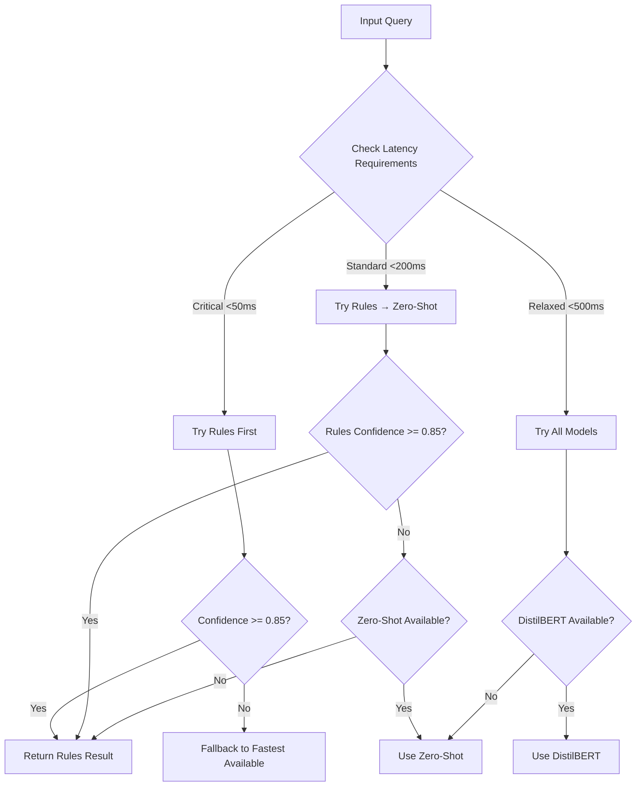

# Wave 6: Adaptive Multi-Model Classifier

## Overview

Wave 6 implements an intelligent routing system that dynamically selects the optimal classification model based on:
- **Confidence thresholds**: Route to more accurate models when confidence is low
- **Latency requirements**: Balance accuracy vs speed based on use case
- **A/B testing**: Continuously experiment with routing strategies
- **Real-time metrics**: Track performance and adjust routing decisions

## Architecture

### Model Hierarchy

1. **Rule-Based Classifier** (Fastest)
   - Latency: ~10-30ms
   - Accuracy: ~75%
   - Best for: Simple, well-defined queries

2. **Zero-Shot Classifier** (Balanced)
   - Latency: ~100-200ms
   - Accuracy: ~85%
   - Best for: Moderate complexity, diverse intents

3. **DistilBERT via TorchServe** (Most Accurate)
   - Latency: ~300-500ms
   - Accuracy: ~92%
   - Best for: Complex, nuanced queries

### Routing Decision Flow



## Configuration

### Environment Variables

```env
# Enable adaptive routing
ENABLE_ADAPTIVE_ROUTING=true

# A/B testing configuration
AB_TEST_PERCENTAGE=0.1  # 10% of traffic

# Model confidence thresholds
RULES_CONFIDENCE_THRESHOLD=0.85
ZERO_SHOT_CONFIDENCE_THRESHOLD=0.70
DISTILBERT_CONFIDENCE_THRESHOLD=0.0  # Always accept

# Latency targets (milliseconds)
LATENCY_TARGET_CRITICAL=50
LATENCY_TARGET_STANDARD=200
LATENCY_TARGET_RELAXED=500

# Initial accuracy estimates
RULES_ACCURACY_ESTIMATE=0.75
ZERO_SHOT_ACCURACY_ESTIMATE=0.85
DISTILBERT_ACCURACY_ESTIMATE=0.92
```

## API Endpoints

### Classification with Routing

The standard classification endpoint now includes routing metadata:

```bash
POST /api/v1/intents/classify
Content-Type: application/json

{
    "text": "Explain how neural networks work",
    "latency_requirement": "standard"  # Optional: "critical", "standard", "relaxed"
}
```

Response includes routing information:

```json
{
    "intent": "explanation",
    "confidence": 0.87,
    "complexity": "moderate",
    "suggested_techniques": ["chain_of_thought", "analogical"],
    "metadata": {
        "processing_time": 0.125,
        "model_version": "v1",
        "tokens_used": 50
    },
    "wave6_routing": {
        "enabled": true,
        "selected_model": "zero_shot",
        "expected_latency": 150.0,
        "reasons": [
            "Rules confidence 0.65 < 0.85",
            "Zero-shot latency acceptable: 150ms <= 200ms"
        ],
        "ab_test_group": "balanced"
    },
    "routing_metadata": {
        "selected_model": "zero_shot",
        "latency_ms": 125.3,
        "routing_reasons": [...],
        "ab_test_group": "balanced"
    }
}
```

### Routing Statistics

Get real-time routing performance metrics:

```bash
GET /api/v1/intents/routing/stats
```

Response:

```json
{
    "total_requests": 1523,
    "model_distribution": {
        "rules": {
            "count": 892,
            "percentage": 58.6
        },
        "zero_shot": {
            "count": 456,
            "percentage": 29.9
        },
        "distilbert": {
            "count": 175,
            "percentage": 11.5
        }
    },
    "average_latencies": {
        "rules": {
            "p50": 15.2,
            "p95": 28.5,
            "p99": 35.1
        },
        "zero_shot": {
            "p50": 125.3,
            "p95": 185.7,
            "p99": 210.2
        },
        "distilbert": {
            "p50": 320.5,
            "p95": 420.8,
            "p99": 485.3
        }
    },
    "ab_test_groups": {
        "control": {
            "count": 130,
            "avg_latency": 95.2,
            "avg_confidence": 0.82
        },
        "aggressive_rules": {
            "count": 45,
            "avg_latency": 25.3,
            "avg_confidence": 0.78
        },
        "balanced": {
            "count": 52,
            "avg_latency": 115.7,
            "avg_confidence": 0.85
        },
        "quality_first": {
            "count": 38,
            "avg_latency": 350.2,
            "avg_confidence": 0.91
        }
    },
    "wave6_metadata": {
        "enabled": true,
        "ab_testing_enabled": true,
        "ab_test_percentage": 10,
        "routing_strategies": ["control", "aggressive_rules", "balanced", "quality_first"]
    }
}
```

### Update Routing Configuration

Dynamically adjust routing parameters:

```bash
POST /api/v1/intents/routing/config
Content-Type: application/json

{
    "model_type": "rules",
    "confidence_threshold": 0.8,
    "accuracy_estimate": 0.77
}
```

## A/B Testing Strategies

The system includes four routing strategies for A/B testing:

### 1. Control (Default)
- Progressive upgrade based on confidence
- Balances latency and accuracy
- Most conservative approach

### 2. Aggressive Rules
- Lower confidence threshold (0.75) for rules
- Minimizes latency at potential accuracy cost
- Good for high-volume, latency-sensitive applications

### 3. Balanced
- Prefers zero-shot when latency allows
- Good balance of accuracy and speed
- Suitable for most use cases

### 4. Quality First
- Always uses the most accurate model available
- Ignores latency constraints
- Best for accuracy-critical applications

## Integration with Existing System

### Using the Adaptive Router

The adaptive router is automatically initialized when:
1. `ENABLE_ADAPTIVE_ROUTING=true` in configuration
2. The intent classifier service starts up
3. All required classifiers are available

### Fallback Behavior

If a selected model fails, the router automatically falls back:
- DistilBERT → Zero-Shot → Rules
- Each fallback is logged for monitoring

### Monitoring and Observability

The router provides detailed metrics via Prometheus:
- `intent_routing_decisions_total{model,ab_group}`
- `intent_routing_latency_seconds{model,percentile}`
- `intent_routing_confidence{model}`
- `intent_routing_fallbacks_total{from,to}`

## Performance Optimization

### Caching Strategy

Results are cached based on:
- Input text hash
- Selected model
- Confidence score

Cache TTL varies by model:
- Rules: 1 hour (stable patterns)
- Zero-shot: 30 minutes
- DistilBERT: 24 hours (most accurate)

### Batch Processing

For batch requests, the router:
1. Groups by latency requirement
2. Processes similar queries together
3. Optimizes model loading/unloading

## Future Enhancements

### Planned Features

1. **Dynamic Threshold Learning**
   - Automatically adjust thresholds based on feedback
   - Use reinforcement learning for optimal routing

2. **Cost-Based Routing**
   - Consider computational cost in routing decisions
   - Optimize for cost/performance ratio

3. **User-Specific Routing**
   - Personalize routing based on user preferences
   - Track user satisfaction with different models

4. **Multi-Region Routing**
   - Route to different model deployments by region
   - Consider network latency in routing

## Testing

### Running Tests

```bash
# Unit tests for adaptive router
pytest tests/test_adaptive_router.py -v

# Integration tests
python demo_wave6_routing.py

# Load testing
locust -f tests/load_test_routing.py --host=http://localhost:8001
```

### Test Scenarios

1. **Latency Requirements**
   - Critical: <50ms → Rules only
   - Standard: <200ms → Rules + Zero-shot
   - Relaxed: <500ms → All models

2. **Confidence Thresholds**
   - High confidence → Stay with current model
   - Low confidence → Upgrade to better model

3. **A/B Testing**
   - Random assignment for new users
   - Consistent assignment for returning users

## Troubleshooting

### Common Issues

1. **All requests using rules only**
   - Check if TorchServe is running
   - Verify confidence thresholds
   - Check latency requirements

2. **High latency despite requirements**
   - Model warmup may be needed
   - Check resource availability
   - Review routing statistics

3. **A/B test groups not balanced**
   - Small sample size initially
   - Check AB_TEST_PERCENTAGE setting
   - Verify random assignment logic

### Debug Logging

Enable debug logging for detailed routing decisions:

```python
import logging
logging.getLogger("app.models.adaptive_router").setLevel(logging.DEBUG)
```

## Conclusion

Wave 6's adaptive routing provides intelligent model selection that balances accuracy, latency, and resource usage. The A/B testing framework enables continuous optimization of routing strategies based on real-world performance data.