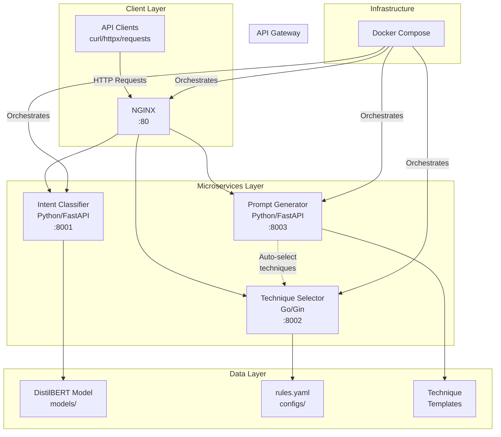
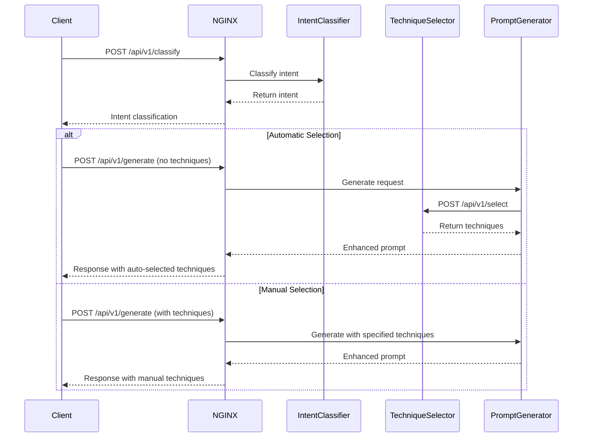
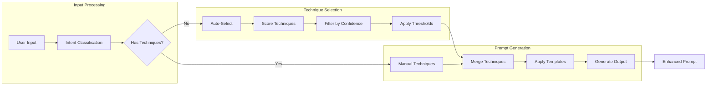
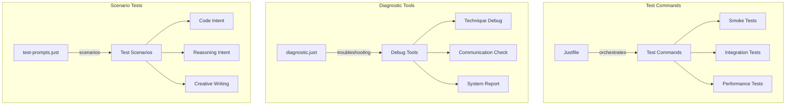

# BetterPrompts Architecture Overview

## System Architecture



## Request Flow



## Directory Structure

```
BetterPrompts/
│
├── backend/
│   └── services/
│       ├── intent-classifier/   # Python/FastAPI Service
│       │   ├── app/
│       │   │   ├── main.py     # FastAPI app
│       │   │   ├── models.py   # Data models
│       │   │   └── classifier.py # ML logic
│       │   ├── models/         # DistilBERT model
│       │   └── Dockerfile
│       │
│       ├── technique-selector/  # Go/Gin Service
│       │   ├── cmd/            # Main application
│       │   ├── internal/       # Business logic
│       │   │   ├── handlers/   # HTTP handlers
│       │   │   ├── rules/      # Selection engine
│       │   │   └── models/     # Data structures
│       │   ├── configs/
│       │   │   └── rules.yaml  # Selection rules
│       │   └── Dockerfile
│       │
│       └── prompt-generator/    # Python/FastAPI Service
│           ├── app/
│           │   ├── main.py     # FastAPI app
│           │   ├── engine.py   # Generation logic
│           │   ├── models.py   # Request/Response
│           │   └── techniques/ # Technique implementations
│           └── Dockerfile
│
├── docker/
│   └── nginx/
│       └── conf.d/
│           └── api.conf        # Routing rules
│
├── docker-compose.yml          # Service orchestration
│
├── scripts/                     # Utility scripts
│   └── setup_git_lfs.sh
│
├── Justfile                    # Main test commands
├── test-prompts.just           # Scenario tests
├── diagnostic.just             # Troubleshooting
└── TEST_COMMANDS.md            # Test documentation
```

## Service Details

### 1. Intent Classifier (Port 8001)
```yaml
Technology: Python 3.11, FastAPI, PyTorch
Model: DistilBERT (fine-tuned)
Purpose: Classify user intent from text
Endpoints:
  - POST /classify
  - GET /health
Response Time: ~200ms
```

### 2. Technique Selector (Port 8002)
```yaml
Technology: Go 1.21, Gin Framework
Configuration: YAML-based rules engine
Purpose: Select optimal prompt techniques
Endpoints:
  - POST /api/v1/select
  - GET /health
Features:
  - Score-based selection
  - Complexity filtering
  - Confidence thresholds
Response Time: ~50ms
```

### 3. Prompt Generator (Port 8003)
```yaml
Technology: Python 3.11, FastAPI
Integration: Calls Technique Selector
Purpose: Apply techniques to enhance prompts
Endpoints:
  - POST /api/v1/generate
  - GET /api/v1/techniques
  - GET /health
Techniques:
  - zero_shot
  - few_shot
  - chain_of_thought
  - structured_output
  - self_consistency
  - analogical
Response Time: ~100-300ms
```

## Data Flow



## Configuration

### Docker Compose Services
```yaml
services:
  nginx:             # Port 80
  intent-classifier: # Port 8001
  technique-selector: # Port 8002  
  prompt-generator:   # Port 8003
```

### NGINX Routing
```nginx
/api/intent → intent-classifier:8001
/api/techniques → technique-selector:8002
/api/enhance → prompt-generator:8003
```

## Testing Infrastructure



## Key Integration Points

1. **Prompt Generator ↔ Technique Selector**
   - Automatic technique selection when not specified
   - Fallback to zero_shot on failure
   - Filters unknown techniques

2. **Client ↔ Backend Services**
   - All traffic routed through NGINX
   - RESTful API communication
   - JSON request/response format
   - Tested via curl/Just commands

3. **Service Discovery**
   - Docker Compose internal networking
   - Service names as hostnames
   - Health checks for availability

## Deployment

```bash
# Development
docker compose up -d

# Testing
just test-integration

# Monitoring
just health
just logs [service]
```