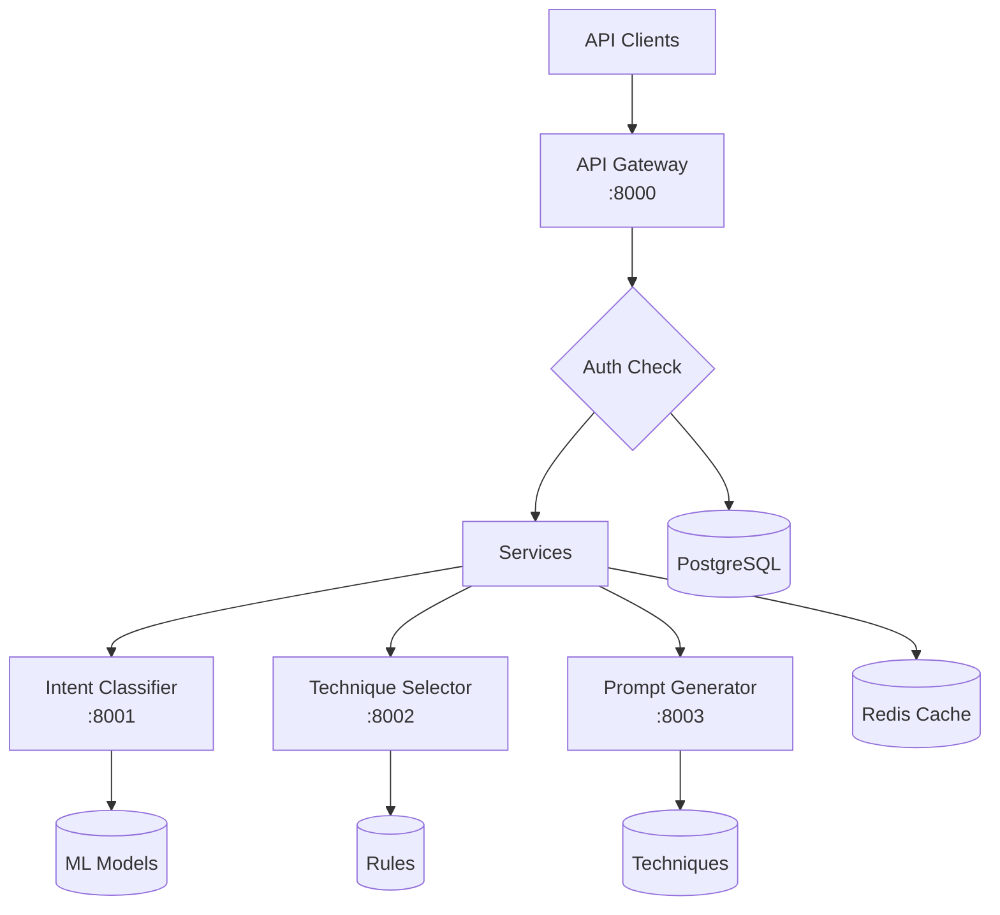
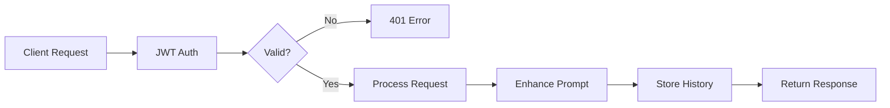
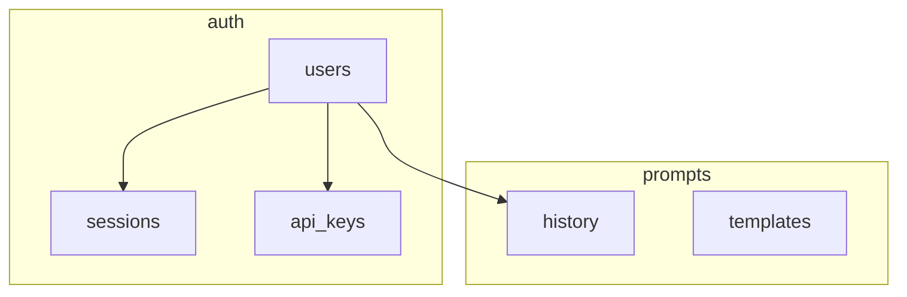

# BetterPrompts Architecture Overview

## System Architecture



## Directory Structure

```
BetterPrompts/
├── backend/
│   ├── services/
│   │   ├── api-gateway/        # Go/Gin Gateway (Port 8000)
│   │   │   ├── internal/
│   │   │   │   ├── auth/       # JWT authentication
│   │   │   │   ├── handlers/   # API endpoints
│   │   │   │   ├── middleware/ # Auth, CORS, logging
│   │   │   │   └── services/   # User, prompt services
│   │   │   └── migrations/     # Database migrations
│   │   │
│   │   ├── intent-classifier/  # Python ML Service (Port 8001)
│   │   ├── technique-selector/ # Go Rules Engine (Port 8002)
│   │   └── prompt-generator/   # Python Generator (Port 8003)
│   │
│   └── infrastructure/
│       └── database/
│           └── migrations/      # PostgreSQL schemas
│
├── tests/                       # pytest test suite
│   ├── test_auth_api.py       # Auth endpoints
│   └── test_auth_flow.py      # Full auth flow
│
├── docker-compose.yml          # All services
├── Justfile                    # Main commands
└── database.just               # DB management
```

## Core Services

### API Gateway (Port 8000)
- **Tech**: Go 1.21, Gin Framework
- **Auth**: JWT tokens with Bearer authentication
- **Database**: PostgreSQL with auth schemas
- **Endpoints**:
  - `POST /api/v1/auth/register` - User registration
  - `POST /api/v1/auth/login` - User login
  - `POST /api/v1/auth/refresh` - Token refresh
  - `GET /api/v1/auth/profile` - User profile
  - `POST /api/v1/enhance` - Enhance prompts
  - `GET /api/v1/history` - Prompt history

### Intent Classifier (Port 8001)
- **Tech**: Python 3.11, FastAPI, PyTorch
- **Model**: DistilBERT (fine-tuned)
- **Purpose**: Classify user intent from text
- **Response**: ~200ms

### Technique Selector (Port 8002)
- **Tech**: Go 1.21, Gin
- **Config**: YAML rules engine
- **Purpose**: Select optimal techniques
- **Response**: ~50ms

### Prompt Generator (Port 8003)
- **Tech**: Python 3.11, FastAPI
- **Purpose**: Apply techniques to prompts
- **Techniques**: zero_shot, few_shot, chain_of_thought, structured_output
- **Response**: ~100-300ms

## Request Flow



## Database Schema



### Key Tables
- **auth.users**: User accounts with JWT auth
- **auth.sessions**: Active user sessions
- **prompts.history**: Prompt enhancement history
- **prompts.templates**: Reusable prompt templates

## Quick Start

```bash
# 1. Start services
docker compose up -d

# 2. Setup database
just setup-db

# 3. Run tests
just test-auth

# 4. Check health
just health
```

## Testing

### Test Commands
- `just test-auth` - Run authentication tests
- `just test-integration` - Full integration tests
- `just smoke-test` - Quick health check

### Database Commands
- `just setup-db` - Initialize database with migrations
- `just reset-db` - Clean reset of database
- `just migrate` - Run pending migrations

## API Usage

### Authentication
```bash
# Register
curl -X POST localhost:8000/api/v1/auth/register \
  -H "Content-Type: application/json" \
  -d '{"email":"user@example.com","username":"user","password":"Pass123!"}'

# Login
curl -X POST localhost:8000/api/v1/auth/login \
  -H "Content-Type: application/json" \
  -d '{"email_or_username":"user","password":"Pass123!"}'

# Use API with token
curl -H "Authorization: Bearer $TOKEN" \
  localhost:8000/api/v1/history
```

## Environment

- **Development**: Docker Compose with hot reload
- **Database**: PostgreSQL 15 with auth schemas
- **Cache**: Redis for session management
- **Auth**: JWT with Bearer tokens
- **Testing**: pytest for API testing