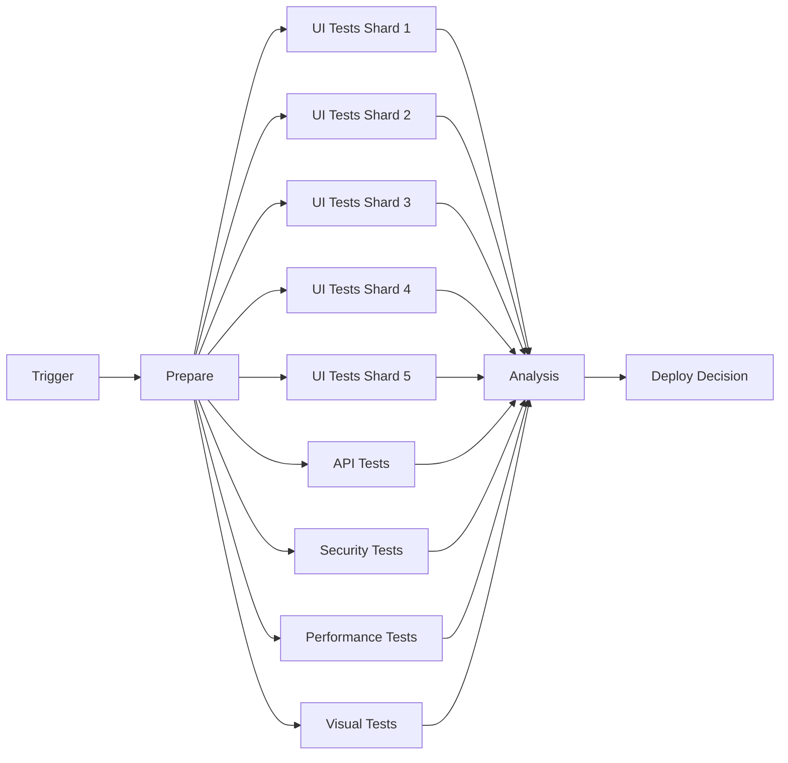

# BetterPrompts E2E Test Architecture - Wave 1 Analysis

## Executive Summary

This comprehensive analysis provides the foundation for BetterPrompts' end-to-end testing strategy, covering user story mapping, journey analysis, test scenarios, architecture design, tool selection, and CI/CD pipeline design. The strategy is designed to ensure quality across all user touchpoints while maintaining rapid feedback cycles and supporting the system's goal of democratizing prompt engineering.

## Table of Contents
1. [User Story Inventory](#1-user-story-inventory)
2. [User Journey Maps](#2-user-journey-maps)
3. [Test Scenario Matrix](#3-test-scenario-matrix)
4. [Test Architecture Design](#4-test-architecture-design)
5. [Tool Evaluation Matrix](#5-tool-evaluation-matrix)
6. [CI/CD Pipeline Architecture](#6-cicd-pipeline-architecture)
7. [Implementation Roadmap](#7-implementation-roadmap)

---

## 1. User Story Inventory

### Non-Technical User (Sarah) - Marketing Professional

#### US-001: Basic Prompt Enhancement (P0)
**As a** marketing professional  
**I want to** enter a simple prompt and get an enhanced version  
**So that** I can create better AI-generated content without learning prompt engineering

**Acceptance Criteria:**
- Given I am on the BetterPrompts homepage
- When I enter a prompt up to 2000 characters
- Then I receive an enhanced prompt within 2 seconds
- And the enhancement technique is clearly displayed with an explanation

**Dependencies:** None  
**Test Scenarios:** Happy path, max length input, special characters, empty input

#### US-002: Technique Explanation (P1)
**As a** non-technical user  
**I want to** understand why a specific technique was applied  
**So that** I can learn the basics of prompt engineering gradually

**Acceptance Criteria:**
- Given an enhanced prompt is displayed
- When I click "Why this technique?"
- Then I see a simple explanation in non-technical language
- And suggested alternatives are shown

**Dependencies:** US-001  
**Test Scenarios:** Explanation display, alternative suggestions, tooltip interactions

#### US-003: Save Favorite Prompts (P1)
**As a** marketing professional  
**I want to** save my favorite enhanced prompts  
**So that** I can reuse them for similar tasks

**Acceptance Criteria:**
- Given I am logged in
- When I click the "Save" button on an enhanced prompt
- Then the prompt is saved to my library
- And I can access it from my dashboard

**Dependencies:** Authentication system  
**Test Scenarios:** Save flow, library management, search saved prompts

### Technical Beginner (Alex) - Junior Developer

#### US-004: Code Generation Enhancement (P0)
**As a** junior developer  
**I want to** enhance prompts for code generation  
**So that** I get better code outputs from AI assistants

**Acceptance Criteria:**
- Given I select "Code Generation" as my intent
- When I enter a coding prompt
- Then I receive an enhanced prompt with proper formatting
- And code-specific techniques are applied

**Dependencies:** Intent classifier  
**Test Scenarios:** Language detection, formatting preservation, technique selection

#### US-005: Compare Techniques (P2)
**As a** technical beginner  
**I want to** compare different enhancement techniques  
**So that** I can understand their trade-offs

**Acceptance Criteria:**
- Given multiple techniques are available
- When I click "Compare Techniques"
- Then I see side-by-side comparisons
- And performance metrics for each technique

**Dependencies:** US-001, Technique selector  
**Test Scenarios:** Comparison UI, metric accuracy, technique switching

#### US-006: API Usage Examples (P1)
**As a** developer  
**I want to** see API usage examples  
**So that** I can integrate BetterPrompts into my applications

**Acceptance Criteria:**
- Given I navigate to API documentation
- When I select a programming language
- Then I see working code examples
- And can test the API directly from the docs

**Dependencies:** API Gateway  
**Test Scenarios:** Code snippet accuracy, API playground, authentication flow

### Data Scientist (Dr. Chen) - ML Expert

#### US-007: Batch Processing (P0)
**As a** data scientist  
**I want to** process multiple prompts in batch  
**So that** I can enhance large datasets efficiently

**Acceptance Criteria:**
- Given I upload a CSV with up to 1000 prompts
- When I initiate batch processing
- Then I see a progress indicator
- And receive results within 5 minutes with downloadable output

**Dependencies:** Batch processing system  
**Test Scenarios:** File upload, progress tracking, result download, error handling

#### US-008: Performance Metrics Dashboard (P1)
**As a** ML expert  
**I want to** see detailed performance metrics  
**So that** I can evaluate the effectiveness of enhancements

**Acceptance Criteria:**
- Given I have processed prompts
- When I access the metrics dashboard
- Then I see accuracy scores, latency data, and technique distribution
- And can export metrics in multiple formats

**Dependencies:** Analytics system  
**Test Scenarios:** Metric calculation, visualization, export formats

#### US-009: Custom Model Integration (P2)
**As a** data scientist  
**I want to** test my own prompt enhancement models  
**So that** I can compare against BetterPrompts' performance

**Acceptance Criteria:**
- Given I have API access
- When I submit requests with custom model parameters
- Then I receive comparative analysis
- And can A/B test different approaches

**Dependencies:** API Gateway, A/B testing framework  
**Test Scenarios:** Model comparison, A/B test setup, result analysis

### Content Creator (Maria) - Educational Content

#### US-010: Template Library (P1)
**As a** content creator  
**I want to** access pre-built prompt templates  
**So that** I can quickly create content for different formats

**Acceptance Criteria:**
- Given I browse the template library
- When I select a template category
- Then I see relevant templates with examples
- And can customize them for my needs

**Dependencies:** Template system  
**Test Scenarios:** Template browsing, customization, category filtering

#### US-011: Bulk Export (P1)
**As a** content creator  
**I want to** export enhanced prompts in bulk  
**So that** I can use them in my content management system

**Acceptance Criteria:**
- Given I have multiple enhanced prompts
- When I select prompts and click "Export"
- Then I can choose export format (JSON, CSV, TXT)
- And download includes all metadata

**Dependencies:** Export system  
**Test Scenarios:** Multi-select, format conversion, metadata preservation

#### US-012: Collaboration Features (P2)
**As a** content creator  
**I want to** share enhanced prompts with my team  
**So that** we can maintain consistency in our content

**Acceptance Criteria:**
- Given I have team members added
- When I share a prompt or collection
- Then team members receive notifications
- And can view/edit based on permissions

**Dependencies:** Team management, Permissions system  
**Test Scenarios:** Sharing flow, permission levels, notification delivery

### Enterprise User (TechCorp) - Corporate Team

#### US-013: SSO Integration (P0)
**As an** enterprise user  
**I want to** log in using corporate SSO  
**So that** I can use BetterPrompts with company authentication

**Acceptance Criteria:**
- Given my company has SSO configured
- When I click "Login with SSO"
- Then I am redirected to corporate login
- And authenticated with proper role assignment

**Dependencies:** SSO provider integration  
**Test Scenarios:** SAML flow, role mapping, session management

#### US-014: Audit Trail (P0)
**As an** enterprise admin  
**I want to** view audit trails of all prompt enhancements  
**So that** I can ensure compliance and track usage

**Acceptance Criteria:**
- Given I have admin privileges
- When I access the audit log
- Then I see all team activities with timestamps
- And can filter by user, date, or action type

**Dependencies:** Audit logging system  
**Test Scenarios:** Log completeness, filtering, export capabilities

#### US-015: API Rate Limiting (P1)
**As an** enterprise user  
**I want to** have dedicated rate limits  
**So that** our team's usage doesn't affect others

**Acceptance Criteria:**
- Given we have an enterprise plan
- When we make API requests
- Then we have 1000 req/min limit
- And receive clear rate limit headers

**Dependencies:** Rate limiting system  
**Test Scenarios:** Rate limit enforcement, header accuracy, quota management

#### US-016: Custom Deployment (P2)
**As an** enterprise architect  
**I want to** deploy BetterPrompts on-premise  
**So that** sensitive data stays within our infrastructure

**Acceptance Criteria:**
- Given we have on-premise requirements
- When we deploy using provided containers
- Then all services run in our environment
- And data never leaves our network

**Dependencies:** Containerization, deployment docs  
**Test Scenarios:** Deployment validation, data isolation, connectivity tests

### Cross-Persona Stories

#### US-017: Multi-language Support (P1)
**As any** user  
**I want to** use BetterPrompts in my native language  
**So that** I can work more effectively

**Acceptance Criteria:**
- Given the UI supports multiple languages
- When I change language settings
- Then all UI elements update accordingly
- And prompt enhancement works for non-English prompts

**Dependencies:** i18n system  
**Test Scenarios:** Language switching, RTL support, prompt language detection

#### US-018: Mobile Experience (P1)
**As any** user  
**I want to** use BetterPrompts on mobile devices  
**So that** I can enhance prompts on the go

**Acceptance Criteria:**
- Given I access BetterPrompts on mobile
- When I use core features
- Then the interface is responsive and touch-friendly
- And all features work without desktop

**Dependencies:** Responsive design  
**Test Scenarios:** Touch interactions, viewport sizes, offline capability

#### US-019: Accessibility Compliance (P0)
**As a** user with disabilities  
**I want to** use BetterPrompts with assistive technology  
**So that** I have equal access to features

**Acceptance Criteria:**
- Given WCAG 2.1 AA compliance
- When I use screen readers or keyboard navigation
- Then all features are accessible
- And proper ARIA labels are present

**Dependencies:** Accessibility framework  
**Test Scenarios:** Screen reader testing, keyboard navigation, color contrast

#### US-020: Feedback System (P2)
**As any** user  
**I want to** provide feedback on enhancements  
**So that** the system can improve over time

**Acceptance Criteria:**
- Given an enhanced prompt
- When I rate it or provide feedback
- Then my input is recorded
- And influences future enhancements

**Dependencies:** Feedback system, ML training pipeline  
**Test Scenarios:** Rating flow, feedback submission, improvement tracking

---

## 2. User Journey Maps

### Sarah (Non-Technical User) Journey

**Entry Points:**
- Google search for "AI prompt improvement"
- Social media ad targeting marketers
- Colleague recommendation
- Content marketing blog post

**Key Interaction Flow:**
1. **Landing** → Views simple, clean interface
2. **First Prompt** → Enters marketing copy request
3. **Enhancement** → Sees improved prompt with explanation
4. **Success** → Gets better AI output, saves time
5. **Retention** → Saves favorite prompts, returns regularly

**Decision Points:**
- "Is this too technical?" → No, interface is simple
- "Will this actually help?" → Yes, clear before/after
- "Is it worth paying?" → Free tier sufficient initially

**Success Criteria:**
- Enhanced prompt in <2 seconds
- Clear improvement visible
- Non-technical explanation provided

**Potential Failure Points:**
- Confusing technical jargon
- Slow response time
- Unclear value proposition

### Alex (Technical Beginner) Journey

**Entry Points:**
- Dev.to article about prompt engineering
- GitHub repository link
- Stack Overflow answer
- YouTube tutorial

**Key Interaction Flow:**
1. **Discovery** → Finds API documentation
2. **Experimentation** → Tests with code prompts
3. **Integration** → Adds to development workflow
4. **Learning** → Explores different techniques
5. **Advocacy** → Shares with team

**Decision Points:**
- "Can I integrate this?" → Yes, simple API
- "Does it work for code?" → Yes, code-specific enhancements
- "Is it better than manual?" → Yes, consistent improvements

**Success Criteria:**
- API integration in <30 minutes
- Code-appropriate enhancements
- Clear documentation available

**Potential Failure Points:**
- Complex API authentication
- Poor code formatting preservation
- Lack of language-specific optimization

### Dr. Chen (Data Scientist) Journey

**Entry Points:**
- Academic paper citation
- ML community forum
- Conference presentation
- Direct search for "prompt optimization"

**Key Interaction Flow:**
1. **Research** → Evaluates methodology
2. **Testing** → Runs batch experiments
3. **Analysis** → Reviews performance metrics
4. **Comparison** → Benchmarks against baselines
5. **Adoption** → Integrates into pipeline

**Decision Points:**
- "Is this scientifically sound?" → Yes, published approach
- "Can I validate results?" → Yes, detailed metrics
- "Does it scale?" → Yes, batch processing available

**Success Criteria:**
- Batch processing of 1000+ prompts
- Detailed performance metrics
- Export capabilities for analysis

**Potential Failure Points:**
- Lack of statistical significance
- No A/B testing capability
- Limited batch size

### Maria (Content Creator) Journey

**Entry Points:**
- Content creator newsletter
- YouTube sponsorship
- Podcast mention
- Writing community recommendation

**Key Interaction Flow:**
1. **Explore** → Browses template library
2. **Create** → Enhances content prompts
3. **Organize** → Builds prompt collections
4. **Share** → Collaborates with team
5. **Scale** → Develops content system

**Decision Points:**
- "Will this speed up creation?" → Yes, templates available
- "Can my team use it?" → Yes, collaboration features
- "Is it worth the cost?" → Yes, time savings significant

**Success Criteria:**
- 50% time reduction in prompt creation
- Team collaboration working smoothly
- Template library comprehensive

**Potential Failure Points:**
- Limited template variety
- Poor collaboration features
- No version control

### TechCorp (Enterprise) Journey

**Entry Points:**
- Vendor evaluation process
- Industry analyst report
- Compliance requirement
- Innovation team discovery

**Key Interaction Flow:**
1. **Evaluation** → Security & compliance review
2. **Pilot** → Limited team trial
3. **Integration** → SSO and API setup
4. **Rollout** → Company-wide deployment
5. **Optimization** → Usage monitoring & training

**Decision Points:**
- "Is it secure?" → Yes, SOC 2 compliant
- "Can we control it?" → Yes, admin features
- "Will it scale?" → Yes, enterprise infrastructure

**Success Criteria:**
- SSO integration working
- Audit trails comprehensive
- SLA guarantees met

**Potential Failure Points:**
- Security vulnerabilities
- No on-premise option
- Poor enterprise support

---

## 3. Test Scenario Matrix

### Happy Path Scenarios (20)

| ID | Scenario | Persona | Priority |
|----|----------|---------|----------|
| HP-01 | First-time user enhances marketing prompt | Sarah | P0 |
| HP-02 | User saves and retrieves favorite prompt | Sarah | P1 |
| HP-03 | Developer integrates API successfully | Alex | P0 |
| HP-04 | Batch processing of 100 prompts | Dr. Chen | P0 |
| HP-05 | Template selection and customization | Maria | P1 |
| HP-06 | SSO login and team access | TechCorp | P0 |
| HP-07 | Mobile user enhances prompt | All | P1 |
| HP-08 | Multi-language prompt enhancement | All | P1 |
| HP-09 | Export enhanced prompts as CSV | Maria | P1 |
| HP-10 | View performance metrics dashboard | Dr. Chen | P1 |
| HP-11 | Compare multiple techniques | Alex | P2 |
| HP-12 | Share prompt with team member | Maria | P2 |
| HP-13 | Admin views audit trail | TechCorp | P0 |
| HP-14 | User provides feedback on enhancement | All | P2 |
| HP-15 | API pagination through results | Alex | P1 |
| HP-16 | Keyboard navigation through UI | All | P0 |
| HP-17 | Create and manage prompt collection | Maria | P2 |
| HP-18 | Change UI language preference | All | P1 |
| HP-19 | Rate limit handling in API | TechCorp | P1 |
| HP-20 | Download batch results | Dr. Chen | P0 |

### Edge Cases & Error Scenarios (20)

| ID | Scenario | Expected Behavior | Priority |
|----|----------|-------------------|----------|
| EC-01 | 2001 character prompt input | Graceful truncation warning | P1 |
| EC-02 | Malformed CSV upload | Clear error message, example provided | P1 |
| EC-03 | Network timeout during enhancement | Retry mechanism, user notification | P0 |
| EC-04 | SSO provider unavailable | Fallback to standard login | P0 |
| EC-05 | API rate limit exceeded | 429 status, retry-after header | P0 |
| EC-06 | Invalid API authentication | 401 status, clear error message | P0 |
| EC-07 | Batch job >1000 prompts | Reject with size limit message | P1 |
| EC-08 | Special characters in prompt | Proper escaping and handling | P1 |
| EC-09 | Browser back button behavior | State preservation | P2 |
| EC-10 | Session timeout handling | Graceful re-authentication | P1 |
| EC-11 | Duplicate prompt in batch | Process both, flag duplicates | P2 |
| EC-12 | Unsupported file format upload | Clear format requirements | P1 |
| EC-13 | Concurrent session limit | Clear message, session management | P1 |
| EC-14 | Database connection failure | Cached response if available | P0 |
| EC-15 | ML model unavailable | Fallback to rule-based enhancement | P0 |
| EC-16 | Export fails mid-process | Partial download recovery | P2 |
| EC-17 | Invalid language selection | Default to English | P2 |
| EC-18 | Mobile orientation change | Layout preservation | P2 |
| EC-19 | Ad blocker interference | Core functionality unaffected | P2 |
| EC-20 | JavaScript disabled | Basic functionality message | P3 |

### Performance Scenarios (10)

| ID | Scenario | Target | Measurement |
|----|----------|--------|-------------|
| PS-01 | Single prompt enhancement latency | <200ms p95 | API response time |
| PS-02 | Concurrent user load (1000 users) | <500ms p95 | End-to-end latency |
| PS-03 | Batch processing throughput | 1000 prompts/min | Processing rate |
| PS-04 | Page load time (3G network) | <3 seconds | Lighthouse score |
| PS-05 | API sustained throughput | 10,000 RPS | Requests handled |
| PS-06 | Database query performance | <50ms p95 | Query execution time |
| PS-07 | Static asset delivery (CDN) | <100ms global | CDN analytics |
| PS-08 | Memory usage under load | <2GB per instance | Container metrics |
| PS-09 | CPU utilization efficiency | <70% average | Container metrics |
| PS-10 | Cache hit ratio | >80% | Redis metrics |

### Security Scenarios (10)

| ID | Scenario | Test Type | Expected Result |
|----|----------|-----------|-----------------|
| SS-01 | SQL injection in prompt input | Injection test | Input sanitized, query safe |
| SS-02 | XSS in enhanced prompt display | XSS test | Output escaped properly |
| SS-03 | JWT token manipulation | Auth test | Token validation fails |
| SS-04 | Rate limit bypass attempt | Abuse test | Rate limit enforced |
| SS-05 | CSRF on state-changing operations | CSRF test | Token required and validated |
| SS-06 | Unauthorized API access | Auth test | 403 Forbidden response |
| SS-07 | Data exposure in API responses | Data leak test | Only authorized data returned |
| SS-08 | Password brute force | Auth test | Account lockout after 5 attempts |
| SS-09 | File upload vulnerability | Upload test | Only allowed formats accepted |
| SS-10 | SSL/TLS configuration | SSL test | A+ SSL Labs rating |

### Integration Scenarios (10)

| ID | Scenario | Integration Point | Validation |
|----|----------|------------------|------------|
| IS-01 | API Gateway → Intent Classifier | Service mesh | Request routing correct |
| IS-02 | Frontend → API Gateway | REST API | Authentication flows |
| IS-03 | Services → PostgreSQL | Database | Connection pooling |
| IS-04 | Services → Redis | Cache | Cache invalidation |
| IS-05 | SSO Provider → Auth Service | SAML/OAuth | Token exchange |
| IS-06 | CDN → Static Assets | CDN | Cache headers correct |
| IS-07 | Monitoring → All Services | Prometheus | Metrics collection |
| IS-08 | Log Aggregation | ELK Stack | Log correlation |
| IS-09 | Email Service → Notifications | SMTP/API | Delivery confirmation |
| IS-10 | Payment Gateway → Billing | Stripe API | Webhook handling |

---

## 4. Test Architecture Design

### Overview

The test architecture follows a modular, scalable design that supports parallel execution, environment isolation, and comprehensive reporting.

```
┌─────────────────────────────────────────────────────────────┐
│                    Test Orchestration Layer                    │
│  ┌─────────────┐  ┌──────────────┐  ┌───────────────────┐  │
│  │   Jenkins   │  │ GitHub Actions│  │  Test Reporting   │  │
│  │   Pipeline  │  │   Workflows  │  │   (Allure/Jest)   │  │
│  └─────────────┘  └──────────────┘  └───────────────────┘  │
└─────────────────────────────────────────────────────────────┘
                              │
┌─────────────────────────────────────────────────────────────┐
│                    Test Execution Layer                        │
│  ┌─────────────┐  ┌──────────────┐  ┌───────────────────┐  │
│  │  Playwright │  │Jest/Supertest│  │       K6          │  │
│  │  (UI/E2E)   │  │ (API/Unit)   │  │ (Load/Perf)       │  │
│  └─────────────┘  └──────────────┘  └───────────────────┘  │
│  ┌─────────────┐  ┌──────────────┐  ┌───────────────────┐  │
│  │   Pact      │  │  OWASP ZAP   │  │   Percy/Chromatic │  │
│  │ (Contract)  │  │  (Security)  │  │    (Visual)       │  │
│  └─────────────┘  └──────────────┘  └───────────────────┘  │
└─────────────────────────────────────────────────────────────┘
                              │
┌─────────────────────────────────────────────────────────────┐
│                 Test Infrastructure Layer                      │
│  ┌─────────────┐  ┌──────────────┐  ┌───────────────────┐  │
│  │Test Database│  │   WireMock   │  │  TestContainers   │  │
│  │  (Postgres) │  │(Mock Services)│ │ (Containerization)│  │
│  └─────────────┘  └──────────────┘  └───────────────────┘  │
│  ┌─────────────┐  ┌──────────────┐  ┌───────────────────┐  │
│  │Test Data Mgr│  │   LocalStack │  │   Monitoring      │  │
│  │  (Fixtures) │  │ (AWS Mocks)  │  │  (Prometheus)     │  │
│  └─────────────┘  └──────────────┘  └───────────────────┘  │
└─────────────────────────────────────────────────────────────┘
```

### Test Environment Strategy

#### Environment Hierarchy

1. **Local Development**
   - Runs on developer machines
   - Uses Docker Compose
   - Mocked external dependencies
   - Fast feedback loop (<5 min)

2. **CI Environment**
   - Triggered on PR/commit
   - Isolated test namespaces
   - Parallel execution
   - Full test suite (<30 min)

3. **Staging Environment**
   - Production-like setup
   - Real external services
   - Performance testing
   - Security scanning

4. **Production Environment**
   - Synthetic monitoring only
   - Read-only smoke tests
   - Continuous validation
   - Zero impact on users

### Test Data Management

#### Data Strategy

```typescript
// test-data/base-generator.ts
export abstract class TestDataGenerator {
  protected faker = faker;
  
  abstract generate(): any;
  
  generateBatch(count: number): any[] {
    return Array(count).fill(null).map(() => this.generate());
  }
}

// test-data/user-generator.ts
export class UserGenerator extends TestDataGenerator {
  generate(): User {
    const persona = this.selectPersona();
    return {
      id: uuid(),
      email: this.faker.internet.email(),
      name: this.faker.name.fullName(),
      role: persona.role,
      preferences: persona.preferences,
      createdAt: this.faker.date.past()
    };
  }
  
  private selectPersona(): Persona {
    const personas = [
      { role: 'marketer', preferences: { complexity: 'simple' } },
      { role: 'developer', preferences: { complexity: 'technical' } },
      { role: 'data_scientist', preferences: { complexity: 'advanced' } },
      { role: 'content_creator', preferences: { complexity: 'moderate' } },
      { role: 'enterprise', preferences: { complexity: 'custom' } }
    ];
    return this.faker.random.arrayElement(personas);
  }
}
```

#### Test Data Lifecycle

1. **Generation** - Create data before test execution
2. **Isolation** - Unique namespace per test run
3. **Cleanup** - Automatic cleanup after tests
4. **Validation** - Verify data integrity

### Service Virtualization

#### Mock Service Architecture

```yaml
# wiremock/mappings/intent-classifier.json
{
  "mappings": [
    {
      "request": {
        "method": "POST",
        "urlPath": "/api/v1/intents/classify",
        "bodyPatterns": [
          { "contains": "explain" }
        ]
      },
      "response": {
        "status": 200,
        "headers": {
          "Content-Type": "application/json"
        },
        "jsonBody": {
          "intent": "question_answering",
          "confidence": 0.95,
          "audience": "beginner"
        },
        "fixedDelayMilliseconds": 50
      }
    }
  ]
}
```

### Integration Patterns

#### API Testing Pattern

```typescript
// e2e/api/base-api-test.ts
export abstract class BaseAPITest {
  protected request: SuperTest<Test>;
  protected authToken: string;
  
  async setup() {
    this.request = supertest(process.env.API_BASE_URL);
    this.authToken = await this.authenticate();
  }
  
  async authenticate(): Promise<string> {
    const response = await this.request
      .post('/auth/login')
      .send({ email: 'test@example.com', password: 'test123' });
    return response.body.token;
  }
  
  protected async makeAuthenticatedRequest(
    method: string,
    path: string,
    body?: any
  ) {
    const req = this.request[method](path)
      .set('Authorization', `Bearer ${this.authToken}`);
    
    if (body) req.send(body);
    return req;
  }
}
```

#### UI Testing Pattern

```typescript
// e2e/pages/base-page.ts
export abstract class BasePage {
  constructor(protected page: Page) {}
  
  async navigate() {
    await this.page.goto(this.getPath());
    await this.waitForLoad();
  }
  
  abstract getPath(): string;
  abstract waitForLoad(): Promise<void>;
  
  async takeScreenshot(name: string) {
    await this.page.screenshot({ 
      path: `screenshots/${name}.png`,
      fullPage: true 
    });
  }
  
  async checkAccessibility() {
    const violations = await new AxePuppeteer(this.page).analyze();
    expect(violations).toHaveLength(0);
  }
}
```

### Monitoring and Reporting

#### Test Metrics Collection

```typescript
// monitoring/test-metrics.ts
export class TestMetrics {
  private prometheus = new PrometheusClient();
  
  recordTestExecution(testName: string, duration: number, status: string) {
    this.prometheus.histogram('e2e_test_duration', duration, {
      test: testName,
      status: status
    });
    
    this.prometheus.counter('e2e_test_total', 1, {
      test: testName,
      status: status
    });
  }
  
  recordFlakiness(testName: string, isFlaky: boolean) {
    if (isFlaky) {
      this.prometheus.counter('e2e_test_flaky', 1, {
        test: testName
      });
    }
  }
}
```

#### Custom Test Reporter

```typescript
// reporting/custom-reporter.ts
export class E2ETestReporter implements Reporter {
  private results: TestResult[] = [];
  
  onTestComplete(test: Test, result: TestResult) {
    this.results.push({
      ...result,
      persona: this.extractPersona(test),
      userStory: this.extractUserStory(test)
    });
  }
  
  onComplete() {
    const report = {
      summary: this.generateSummary(),
      byPersona: this.groupByPersona(),
      byUserStory: this.groupByUserStory(),
      performance: this.calculatePerformance(),
      flakiness: this.calculateFlakiness()
    };
    
    this.saveReport(report);
    this.sendNotifications(report);
  }
}
```

---

## 5. Tool Evaluation Matrix

### UI/E2E Testing Tools

| Criteria | Playwright | Cypress | Selenium | Recommendation |
|----------|------------|---------|----------|----------------|
| **Performance** | ⭐⭐⭐⭐⭐ Fast, parallel | ⭐⭐⭐⭐ Good, but sequential | ⭐⭐⭐ Slower | **Playwright** |
| **Browser Support** | ⭐⭐⭐⭐⭐ All major + Safari | ⭐⭐⭐⭐ Chrome, Firefox, Edge | ⭐⭐⭐⭐⭐ All browsers | **Playwright** |
| **API Testing** | ⭐⭐⭐⭐⭐ Built-in support | ⭐⭐⭐ Via plugins | ⭐⭐ Separate tool needed | **Playwright** |
| **Developer Experience** | ⭐⭐⭐⭐⭐ Excellent debugging | ⭐⭐⭐⭐⭐ Time travel | ⭐⭐⭐ Basic | **Tie** |
| **CI/CD Integration** | ⭐⭐⭐⭐⭐ Excellent | ⭐⭐⭐⭐ Good | ⭐⭐⭐⭐ Good | **Playwright** |
| **Learning Curve** | ⭐⭐⭐⭐ Moderate | ⭐⭐⭐⭐⭐ Easy | ⭐⭐⭐ Steep | **Cypress** |
| **Community** | ⭐⭐⭐⭐ Growing fast | ⭐⭐⭐⭐⭐ Large | ⭐⭐⭐⭐⭐ Largest | **Selenium** |
| **Cost** | Free | Free/Paid | Free | **All Equal** |

**Winner: Playwright** - Best performance, built-in API testing, excellent TypeScript support

### API Testing Tools

| Criteria | Jest/Supertest | Postman/Newman | RestAssured | Recommendation |
|----------|----------------|----------------|-------------|----------------|
| **Language** | JavaScript/TS | JavaScript | Java | **Jest** (matches stack) |
| **Integration** | ⭐⭐⭐⭐⭐ Native | ⭐⭐⭐ External | ⭐⭐⭐ External | **Jest** |
| **Assertions** | ⭐⭐⭐⭐⭐ Jest matchers | ⭐⭐⭐⭐ Chai | ⭐⭐⭐⭐ Hamcrest | **Jest** |
| **Reporting** | ⭐⭐⭐⭐ Good | ⭐⭐⭐⭐⭐ Excellent | ⭐⭐⭐ Basic | **Postman** |
| **CI/CD** | ⭐⭐⭐⭐⭐ Native | ⭐⭐⭐⭐ Newman CLI | ⭐⭐⭐⭐ Maven/Gradle | **Jest** |
| **Contract Testing** | ⭐⭐⭐⭐ Via Pact | ⭐⭐⭐ Limited | ⭐⭐⭐⭐ Spring Cloud | **Tie** |

**Winner: Jest/Supertest** - Native TypeScript, seamless integration

### Load Testing Tools

| Criteria | K6 | JMeter | Gatling | Recommendation |
|----------|-----|---------|---------|----------------|
| **Scripting** | JavaScript | GUI/XML | Scala | **K6** (familiar) |
| **Performance** | ⭐⭐⭐⭐⭐ Excellent | ⭐⭐⭐ Heavy | ⭐⭐⭐⭐⭐ Excellent | **K6/Gatling** |
| **Real-time Results** | ⭐⭐⭐⭐⭐ Built-in | ⭐⭐⭐ Plugins | ⭐⭐⭐⭐⭐ Built-in | **K6/Gatling** |
| **CI/CD Integration** | ⭐⭐⭐⭐⭐ Native | ⭐⭐⭐ Complex | ⭐⭐⭐⭐ Good | **K6** |
| **Cloud Execution** | ⭐⭐⭐⭐⭐ K6 Cloud | ⭐⭐⭐ BlazeMeter | ⭐⭐⭐⭐ Gatling Enterprise | **K6** |
| **Learning Curve** | ⭐⭐⭐⭐⭐ Easy | ⭐⭐⭐ Moderate | ⭐⭐ Steep | **K6** |

**Winner: K6** - JavaScript-based, excellent performance, cloud options

### Contract Testing Tools

| Criteria | Pact | Spring Cloud Contract | Recommendation |
|----------|------|----------------------|----------------|
| **Language Support** | ⭐⭐⭐⭐⭐ Multi-language | ⭐⭐⭐ JVM only | **Pact** |
| **Broker Support** | ⭐⭐⭐⭐⭐ Pact Broker | ⭐⭐⭐ Git-based | **Pact** |
| **CI/CD Integration** | ⭐⭐⭐⭐⭐ Excellent | ⭐⭐⭐⭐ Good | **Pact** |
| **Documentation** | ⭐⭐⭐⭐⭐ Comprehensive | ⭐⭐⭐⭐ Good | **Pact** |
| **Community** | ⭐⭐⭐⭐⭐ Large | ⭐⭐⭐ Spring-focused | **Pact** |

**Winner: Pact** - Language agnostic, mature ecosystem

### Security Testing Tools

| Criteria | OWASP ZAP | Burp Suite | Recommendation |
|----------|-----------|------------|----------------|
| **Automation** | ⭐⭐⭐⭐⭐ Full API | ⭐⭐⭐ Limited | **ZAP** |
| **CI/CD Integration** | ⭐⭐⭐⭐⭐ Native | ⭐⭐⭐ Complex | **ZAP** |
| **Cost** | Free | Paid | **ZAP** |
| **Coverage** | ⭐⭐⭐⭐ Comprehensive | ⭐⭐⭐⭐⭐ Most complete | **Burp** |
| **Ease of Use** | ⭐⭐⭐⭐ Good | ⭐⭐⭐⭐⭐ Excellent | **Burp** |

**Winner: OWASP ZAP** - Free, automatable, CI/CD friendly

### Visual Testing Tools

| Criteria | Percy | Chromatic | Applitools | Playwright | Recommendation |
|----------|--------|-----------|------------|------------|----------------|
| **Integration** | ⭐⭐⭐⭐ Good | ⭐⭐⭐⭐⭐ Storybook | ⭐⭐⭐⭐ Good | ⭐⭐⭐⭐⭐ Native | **Playwright** |
| **Cost** | $$$ | $$$ | $$$$ | Free | **Playwright** |
| **AI Features** | ⭐⭐⭐ Basic | ⭐⭐⭐ Basic | ⭐⭐⭐⭐⭐ Advanced | ⭐⭐ None | **Applitools** |
| **Review UI** | ⭐⭐⭐⭐⭐ Excellent | ⭐⭐⭐⭐⭐ Excellent | ⭐⭐⭐⭐⭐ Excellent | ⭐⭐⭐ Basic | **Paid tools** |
| **Performance** | ⭐⭐⭐⭐ Good | ⭐⭐⭐⭐ Good | ⭐⭐⭐ Slower | ⭐⭐⭐⭐⭐ Fast | **Playwright** |

**Winner: Playwright built-in** - Free, fast, integrated. Consider Percy for advanced needs.

### Recommended Tool Stack

```yaml
test-stack:
  ui-e2e: Playwright          # Primary UI and E2E testing
  api: 
    e2e: Playwright          # API testing within E2E flows
    unit: Jest + Supertest   # Isolated API testing
  load: K6                   # Performance and load testing
  contract: Pact             # Service contract testing
  security: 
    scan: OWASP ZAP         # Automated security scanning
    sca: Trivy              # Container and dependency scanning
  visual: Playwright         # Screenshot comparison (built-in)
  accessibility: axe-core    # WCAG compliance testing
  monitoring: 
    synthetic: Playwright    # Production synthetic monitoring
    apm: Datadog            # Application performance monitoring
```

---

## 6. CI/CD Pipeline Architecture

### Pipeline Overview

```yaml
# .github/workflows/e2e-pipeline.yml
name: E2E Test Pipeline

on:
  pull_request:
    types: [opened, synchronize, reopened]
  push:
    branches: [main, develop]
  schedule:
    - cron: '0 */6 * * *'  # Every 6 hours for synthetic tests

env:
  NODE_VERSION: '18'
  PYTHON_VERSION: '3.11'
  GO_VERSION: '1.21'
```

### Pipeline Stages

#### Stage 1: Prepare (5 min)

```yaml
prepare:
  runs-on: ubuntu-latest
  outputs:
    test-matrix: ${{ steps.matrix.outputs.matrix }}
  steps:
    - uses: actions/checkout@v4
    
    - name: Detect Changes
      id: changes
      uses: dorny/paths-filter@v2
      with:
        filters: |
          frontend:
            - 'frontend/**'
          backend:
            - 'backend/**'
          e2e:
            - 'e2e/**'
    
    - name: Generate Test Matrix
      id: matrix
      run: |
        matrix='{
          "browser": ["chromium", "firefox", "webkit"],
          "shard": [1, 2, 3, 4, 5]
        }'
        echo "matrix=$matrix" >> $GITHUB_OUTPUT
    
    - name: Setup Test Environment
      run: |
        docker-compose -f docker-compose.test.yml up -d
        ./scripts/wait-for-services.sh
    
    - name: Seed Test Data
      run: |
        npm run test:seed
```

#### Stage 2: Test Execution (20 min parallel)

```yaml
test-execution:
  needs: prepare
  runs-on: ubuntu-latest
  strategy:
    matrix: ${{ fromJson(needs.prepare.outputs.test-matrix) }}
    fail-fast: false
  steps:
    - uses: actions/checkout@v4
    
    - name: Cache Dependencies
      uses: actions/cache@v3
      with:
        path: |
          ~/.npm
          ~/.cache/playwright
        key: ${{ runner.os }}-deps-${{ hashFiles('**/package-lock.json') }}
    
    - name: Install Dependencies
      run: |
        npm ci
        npx playwright install --with-deps ${{ matrix.browser }}
    
    - name: Run E2E Tests
      run: |
        npm run test:e2e -- \
          --project=${{ matrix.browser }} \
          --shard=${{ matrix.shard }}/5 \
          --reporter=junit,html \
          --output=test-results/
      env:
        TEST_ENV: ci
        BROWSER: ${{ matrix.browser }}
        SHARD: ${{ matrix.shard }}
    
    - name: Upload Test Results
      if: always()
      uses: actions/upload-artifact@v3
      with:
        name: test-results-${{ matrix.browser }}-${{ matrix.shard }}
        path: test-results/
        retention-days: 30
```

#### Stage 3: Specialized Tests (15 min parallel)

```yaml
specialized-tests:
  needs: prepare
  runs-on: ubuntu-latest
  strategy:
    matrix:
      test-type: [api, security, performance, visual]
  steps:
    - uses: actions/checkout@v4
    
    - name: Run API Contract Tests
      if: matrix.test-type == 'api'
      run: |
        npm run test:contracts
        npx pact publish pacts --consumer-app-version=$GITHUB_SHA
    
    - name: Run Security Tests
      if: matrix.test-type == 'security'
      run: |
        docker run -v $(pwd):/zap/wrk/:rw \
          -t owasp/zap2docker-stable zap-baseline.py \
          -t https://staging.betterprompts.com \
          -r security-report.html
    
    - name: Run Performance Tests
      if: matrix.test-type == 'performance'
      run: |
        k6 run \
          --out influxdb=http://localhost:8086/k6 \
          e2e/performance/load-test.js
    
    - name: Run Visual Tests
      if: matrix.test-type == 'visual'
      run: |
        npm run test:visual
```

#### Stage 4: Analysis & Reporting (5 min)

```yaml
analysis:
  needs: [test-execution, specialized-tests]
  runs-on: ubuntu-latest
  if: always()
  steps:
    - uses: actions/checkout@v4
    
    - name: Download All Artifacts
      uses: actions/download-artifact@v3
      with:
        path: all-results/
    
    - name: Merge Test Results
      run: |
        npm run test:merge-results -- \
          --input=all-results/ \
          --output=final-results/
    
    - name: Generate Test Report
      run: |
        npm run test:report -- \
          --input=final-results/ \
          --output=test-report.html
    
    - name: Calculate Metrics
      id: metrics
      run: |
        total=$(find final-results -name "*.xml" -exec grep -c "testcase" {} + | awk '{sum += $1} END {print sum}')
        passed=$(find final-results -name "*.xml" -exec grep -c "testcase.*time=" {} + | awk '{sum += $1} END {print sum}')
        failed=$((total - passed))
        
        echo "total=$total" >> $GITHUB_OUTPUT
        echo "passed=$passed" >> $GITHUB_OUTPUT  
        echo "failed=$failed" >> $GITHUB_OUTPUT
        echo "rate=$((passed * 100 / total))" >> $GITHUB_OUTPUT
    
    - name: Comment PR
      if: github.event_name == 'pull_request'
      uses: actions/github-script@v6
      with:
        script: |
          const metrics = ${{ toJson(steps.metrics.outputs) }};
          const comment = `## E2E Test Results
          
          - **Total Tests**: ${metrics.total}
          - **Passed**: ${metrics.passed} ✅
          - **Failed**: ${metrics.failed} ❌
          - **Success Rate**: ${metrics.rate}%
          
          [View Full Report](https://github.com/${{ github.repository }}/actions/runs/${{ github.run_id }})`;
          
          github.rest.issues.createComment({
            issue_number: context.issue.number,
            owner: context.repo.owner,
            repo: context.repo.repo,
            body: comment
          });
```

#### Stage 5: Deployment Decision (2 min)

```yaml
deployment-gate:
  needs: analysis
  runs-on: ubuntu-latest
  if: github.ref == 'refs/heads/main'
  steps:
    - name: Check Quality Gates
      id: quality
      run: |
        # Check test pass rate
        if [ ${{ needs.analysis.outputs.rate }} -lt 95 ]; then
          echo "deploy=false" >> $GITHUB_OUTPUT
          echo "reason=Test pass rate below 95%" >> $GITHUB_OUTPUT
        else
          echo "deploy=true" >> $GITHUB_OUTPUT
        fi
    
    - name: Deploy to Staging
      if: steps.quality.outputs.deploy == 'true'
      run: |
        kubectl set image deployment/betterprompts \
          betterprompts=betterprompts:$GITHUB_SHA \
          -n staging
    
    - name: Run Smoke Tests
      if: steps.quality.outputs.deploy == 'true'
      run: |
        npm run test:smoke -- --env=staging
    
    - name: Notify Team
      if: always()
      uses: 8398a7/action-slack@v3
      with:
        status: ${{ job.status }}
        text: |
          E2E Tests: ${{ needs.analysis.outputs.rate }}% pass rate
          Deployment: ${{ steps.quality.outputs.deploy }}
          Reason: ${{ steps.quality.outputs.reason }}
```

### Parallelization Strategy



### Test Data Management in CI/CD

```yaml
# scripts/test-data-ci.sh
#!/bin/bash

# Create isolated test namespace
export TEST_NAMESPACE="e2e-${GITHUB_RUN_ID}"

# Seed test data
npm run test:seed -- --namespace=$TEST_NAMESPACE

# Run tests with namespace
export DATABASE_URL="${DATABASE_URL}?schema=${TEST_NAMESPACE}"

# Cleanup after tests (in post step)
npm run test:cleanup -- --namespace=$TEST_NAMESPACE
```

### Reporting and Notifications

#### Test Report Generation

```typescript
// scripts/generate-test-report.ts
interface TestReport {
  summary: {
    total: number;
    passed: number;
    failed: number;
    skipped: number;
    duration: number;
  };
  byPersona: Record<string, PersonaResults>;
  byUserStory: Record<string, StoryResults>;
  failures: FailureDetail[];
  performance: PerformanceMetrics;
}

async function generateReport(resultsDir: string): Promise<void> {
  const results = await collectResults(resultsDir);
  const report = analyzeResults(results);
  
  // Generate HTML report
  await generateHTMLReport(report);
  
  // Send to monitoring
  await sendToDatadog(report);
  
  // Update dashboard
  await updateDashboard(report);
  
  // Notify stakeholders
  await notifyStakeholders(report);
}
```

#### Notification Channels

```yaml
notifications:
  slack:
    - channel: "#qa-alerts"
      on: [failure, recovery]
      template: "E2E Tests: {{ status }} - {{ summary }}"
    
    - channel: "#dev-team"
      on: [failure]
      template: "E2E Failure: {{ failed_tests }} - {{ link }}"
  
  email:
    - to: "qa-team@betterprompts.com"
      on: [weekly_summary]
      template: "weekly-e2e-report.html"
  
  pagerduty:
    - service: "e2e-critical"
      on: [critical_failure]
      severity: "high"
```

### Rollback Mechanisms

```yaml
rollback:
  automatic:
    enabled: true
    conditions:
      - smoke_test_failure
      - error_rate > 5%
      - response_time > 1000ms
    
  manual:
    approval_required: true
    approvers: ["qa-lead", "dev-lead"]
    
  procedure:
    - name: Revert Deployment
      run: kubectl rollout undo deployment/betterprompts
    
    - name: Verify Rollback
      run: npm run test:smoke -- --quick
    
    - name: Notify Team
      run: ./scripts/notify-rollback.sh
```

---

## 7. Implementation Roadmap

### Phase 1: Foundation (Weeks 1-2)

**Goals**: Basic infrastructure and initial tests

**Week 1**:
- [ ] Setup Playwright framework
- [ ] Create basic Page Object Models
- [ ] Implement first 5 user stories (US-001 to US-005)
- [ ] Setup GitHub Actions pipeline
- [ ] Create test data generators

**Week 2**:
- [ ] Add API testing with Playwright
- [ ] Implement authentication tests
- [ ] Setup test reporting
- [ ] Add visual regression baseline
- [ ] Document test patterns

**Deliverables**:
- Working test framework
- 20 basic E2E tests
- CI pipeline running on PRs
- Test documentation

### Phase 2: Expansion (Weeks 3-4)

**Goals**: Complete persona coverage and integration tests

**Week 3**:
- [ ] Complete all persona-specific tests
- [ ] Add Pact contract tests
- [ ] Implement performance baselines
- [ ] Setup test environments

**Week 4**:
- [ ] Add security scanning
- [ ] Implement batch processing tests
- [ ] Add accessibility tests
- [ ] Setup monitoring integration

**Deliverables**:
- 50+ E2E tests covering all personas
- Contract tests for all services
- Security scan automation
- Performance baselines

### Phase 3: Advanced Testing (Weeks 5-6)

**Goals**: Performance, security, and visual testing

**Week 5**:
- [ ] Implement K6 load tests
- [ ] Add visual regression for all pages
- [ ] Setup chaos testing
- [ ] Add mobile testing

**Week 6**:
- [ ] Complete security test suite
- [ ] Add internationalization tests
- [ ] Implement synthetic monitoring
- [ ] Setup alerting

**Deliverables**:
- Complete load testing suite
- Visual regression coverage
- Production monitoring
- Alert configuration

### Phase 4: Optimization (Weeks 7-8)

**Goals**: Performance optimization and documentation

**Week 7**:
- [ ] Optimize test execution time
- [ ] Implement test parallelization
- [ ] Add self-healing tests
- [ ] Create troubleshooting guides

**Week 8**:
- [ ] Complete documentation
- [ ] Train team on framework
- [ ] Setup dashboards
- [ ] Plan maintenance strategy

**Deliverables**:
- <30 minute test execution
- Complete documentation
- Team training materials
- Maintenance plan

### Success Metrics

**Coverage**:
- 95% user story coverage
- 100% critical path coverage
- All personas tested

**Quality**:
- <5% test flake rate
- <2% false positives
- 100% reproducible failures

**Performance**:
- <30 minute full suite
- <5 minute smoke tests
- <10 minute API tests

**Team**:
- All developers can write tests
- QA team fully trained
- Automated maintenance tasks

### Risk Mitigation

**Technical Risks**:
1. **Test Flakiness**
   - Mitigation: Retry mechanisms, proper waits
   - Monitoring: Track flake rate per test

2. **Long Execution Time**
   - Mitigation: Parallelization, test optimization
   - Monitoring: Track execution trends

3. **Environment Issues**
   - Mitigation: Container-based environments
   - Monitoring: Environment health checks

**Process Risks**:
1. **Adoption Resistance**
   - Mitigation: Training, documentation
   - Monitoring: Test contribution metrics

2. **Maintenance Burden**
   - Mitigation: Automation, clear ownership
   - Monitoring: Time spent on maintenance

## Conclusion

This comprehensive E2E test architecture provides BetterPrompts with a robust quality assurance framework that:

1. **Covers all user personas** with specific test scenarios
2. **Validates the complete system** from UI to database
3. **Ensures performance** at scale
4. **Maintains security** standards
5. **Supports rapid development** with fast feedback

The recommended tool stack (Playwright, K6, Pact, OWASP ZAP) provides excellent coverage while maintaining simplicity and cost-effectiveness. The phased implementation approach allows for incremental value delivery while building toward comprehensive test coverage.

With this architecture, BetterPrompts can confidently scale to serve millions of users while maintaining high quality and reliability standards.