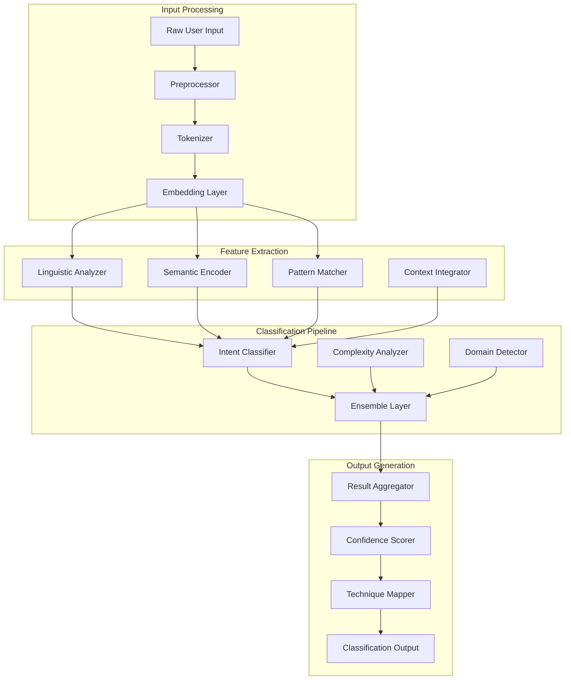

# Prompt Classifier Component - Detailed Design

## Executive Summary

The Prompt Classifier is a sophisticated ML component that analyzes user input to determine intent, assess complexity, and map to optimal prompt engineering techniques. It employs a multi-task learning approach with hierarchical classification, context integration, and continuous learning capabilities.

## Component Architecture

### High-Level Architecture



## Core Model Architecture

### Multi-Task Neural Network

```python
@dataclass
class ClassificationResult:
    primary_intent: str
    intent_scores: Dict[str, float]
    complexity_level: int
    domain: str
    sub_intents: List[str]
    suggested_techniques: List[str]
    confidence: float
    reasoning: str
    metadata: Dict[str, any]

class PromptClassifier(nn.Module):
    """
    Multi-task neural network for prompt classification.
    Handles intent classification, complexity assessment, and domain detection.
    """
    
    def __init__(
        self,
        model_name: str = "microsoft/deberta-v3-base",
        num_intent_classes: int = 15,
        num_domains: int = 8,
        complexity_levels: int = 5,
        hidden_dim: int = 768,
        dropout_rate: float = 0.1
    ):
        super().__init__()
        
        # Pre-trained transformer backbone
        self.transformer = AutoModel.from_pretrained(model_name)
        self.tokenizer = AutoTokenizer.from_pretrained(model_name)
        
        # Task-specific heads with shared representations
        self.shared_layer = nn.Sequential(
            nn.Linear(hidden_dim, hidden_dim),
            nn.LayerNorm(hidden_dim),
            nn.ReLU(),
            nn.Dropout(dropout_rate)
        )
        
        # Intent classification head (multi-label)
        self.intent_classifier = nn.Sequential(
            nn.Linear(hidden_dim, hidden_dim),
            nn.LayerNorm(hidden_dim),
            nn.ReLU(),
            nn.Dropout(dropout_rate),
            nn.Linear(hidden_dim, num_intent_classes),
            nn.Sigmoid()  # Multi-label classification
        )
        
        # Complexity regression head
        self.complexity_regressor = nn.Sequential(
            nn.Linear(hidden_dim, hidden_dim // 2),
            nn.LayerNorm(hidden_dim // 2),
            nn.ReLU(),
            nn.Dropout(dropout_rate),
            nn.Linear(hidden_dim // 2, 1),  # Continuous complexity score
            nn.Sigmoid()  # Normalize to [0, 1]
        )
        
        # Domain classification head
        self.domain_classifier = nn.Sequential(
            nn.Linear(hidden_dim, hidden_dim // 2),
            nn.LayerNorm(hidden_dim // 2),
            nn.ReLU(),
            nn.Dropout(dropout_rate),
            nn.Linear(hidden_dim // 2, num_domains),
            nn.Softmax(dim=-1)
        )
        
        # Multi-head attention for feature fusion
        self.cross_attention = nn.MultiheadAttention(
            embed_dim=hidden_dim,
            num_heads=8,
            dropout=dropout_rate,
            batch_first=True
        )
        
        # Technique mapping layer
        self.technique_mapper = TechniqueMapper(
            hidden_dim=hidden_dim,
            num_techniques=50
        )
```

## Feature Extraction System

### Linguistic Feature Extraction

```python
class LinguisticAnalyzer:
    """
    Extracts linguistic features for enhanced classification.
    """
    
    def __init__(self):
        self.nlp = spacy.load("en_core_web_lg")
        self.readability_calculator = ReadabilityCalculator()
        
    def analyze(self, text: str) -> LinguisticFeatures:
        doc = self.nlp(text)
        
        features = LinguisticFeatures(
            # Syntactic features
            pos_distribution=self._get_pos_distribution(doc),
            dependency_patterns=self._extract_dependency_patterns(doc),
            sentence_lengths=[len(sent) for sent in doc.sents],
            
            # Complexity metrics
            flesch_kincaid_score=self.readability_calculator.flesch_kincaid(text),
            gunning_fog_index=self.readability_calculator.gunning_fog(text),
            vocabulary_diversity=len(set(token.lemma_ for token in doc)) / len(doc),
            
            # Structural features
            num_sentences=len(list(doc.sents)),
            avg_words_per_sentence=len(doc) / len(list(doc.sents)),
            question_count=sum(1 for sent in doc.sents if sent.text.strip().endswith('?')),
            
            # Semantic indicators
            entity_types=self._extract_entity_types(doc),
            verb_tense_distribution=self._analyze_verb_tenses(doc),
            modality_markers=self._detect_modality(doc)
        )
        
        return features
    
    def _extract_dependency_patterns(self, doc) -> Dict[str, int]:
        patterns = defaultdict(int)
        for token in doc:
            pattern = f"{token.dep_}_{token.pos_}"
            patterns[pattern] += 1
        return dict(patterns)
```

### Semantic Feature Extraction

```python
class SemanticEncoder:
    """
    Encodes semantic features using advanced NLP techniques.
    """
    
    def __init__(self):
        self.sentence_encoder = SentenceTransformer('all-mpnet-base-v2')
        self.topic_model = LatentDirichletAllocation(n_components=20)
        self.knowledge_graph = KnowledgeGraphEmbedder()
        
    def encode(self, text: str) -> SemanticFeatures:
        # Sentence-level embeddings
        sentences = sent_tokenize(text)
        sentence_embeddings = self.sentence_encoder.encode(sentences)
        
        # Document-level representation
        doc_embedding = np.mean(sentence_embeddings, axis=0)
        
        # Topic distribution
        topic_distribution = self._get_topic_distribution(text)
        
        # Semantic similarity to technique prototypes
        technique_similarities = self._compute_technique_similarities(doc_embedding)
        
        # Knowledge graph features
        kg_features = self.knowledge_graph.extract_features(text)
        
        return SemanticFeatures(
            doc_embedding=doc_embedding,
            sentence_embeddings=sentence_embeddings,
            topic_distribution=topic_distribution,
            technique_similarities=technique_similarities,
            kg_features=kg_features,
            semantic_coherence=self._compute_coherence(sentence_embeddings)
        )
```

## Intent Classification System

### Hierarchical Intent Taxonomy

```python
class IntentTaxonomy:
    """
    Defines the hierarchical structure of intents.
    """
    
    TAXONOMY = {
        'creative': {
            'writing': {
                'fiction': ['story', 'narrative', 'character', 'plot'],
                'poetry': ['verse', 'rhyme', 'metaphor', 'imagery'],
                'copywriting': ['marketing', 'sales', 'persuasive', 'ad'],
                'technical': ['documentation', 'manual', 'guide', 'tutorial']
            },
            'ideation': {
                'brainstorming': ['ideas', 'concepts', 'possibilities', 'alternatives'],
                'innovation': ['novel', 'unique', 'breakthrough', 'invention'],
                'design': ['visual', 'aesthetic', 'layout', 'composition']
            }
        },
        'analytical': {
            'data_analysis': {
                'statistical': ['correlation', 'regression', 'hypothesis', 'significance'],
                'exploratory': ['patterns', 'trends', 'insights', 'visualization'],
                'predictive': ['forecast', 'projection', 'model', 'estimation']
            },
            'research': {
                'academic': ['literature', 'citation', 'methodology', 'hypothesis'],
                'market': ['competitive', 'consumer', 'trends', 'opportunities'],
                'scientific': ['experiment', 'observation', 'theory', 'evidence']
            }
        },
        'technical': {
            'programming': {
                'implementation': ['code', 'function', 'algorithm', 'feature'],
                'debugging': ['error', 'bug', 'issue', 'fix'],
                'optimization': ['performance', 'efficiency', 'speed', 'memory']
            },
            'architecture': {
                'system': ['design', 'components', 'integration', 'scalability'],
                'database': ['schema', 'query', 'normalization', 'indexing'],
                'api': ['endpoint', 'request', 'response', 'documentation']
            }
        }
    }
```

### Multi-Label Classification

```python
class HierarchicalIntentClassifier:
    """
    Performs hierarchical multi-label intent classification.
    """
    
    def __init__(self, taxonomy: IntentTaxonomy):
        self.taxonomy = taxonomy
        self.level1_classifier = self._build_classifier(level=1)
        self.level2_classifier = self._build_classifier(level=2)
        self.level3_classifier = self._build_classifier(level=3)
        
    def classify(
        self,
        features: torch.Tensor,
        threshold: float = 0.3
    ) -> HierarchicalIntentResult:
        # Top-level classification
        level1_probs = self.level1_classifier(features)
        level1_labels = (level1_probs > threshold).nonzero(as_tuple=True)[1]
        
        # Second-level classification (conditioned on level 1)
        level2_results = {}
        for l1_label in level1_labels:
            l2_features = self._condition_features(features, l1_label)
            l2_probs = self.level2_classifier[l1_label](l2_features)
            level2_results[l1_label] = (l2_probs > threshold).nonzero(as_tuple=True)[1]
        
        # Third-level classification (conditioned on level 2)
        level3_results = {}
        for l1_label, l2_labels in level2_results.items():
            for l2_label in l2_labels:
                l3_features = self._condition_features(features, l1_label, l2_label)
                l3_probs = self.level3_classifier[l1_label][l2_label](l3_features)
                level3_results[(l1_label, l2_label)] = (l3_probs > threshold).nonzero(as_tuple=True)[1]
        
        return HierarchicalIntentResult(
            level1=level1_labels,
            level2=level2_results,
            level3=level3_results,
            confidence_scores=self._aggregate_confidence(level1_probs, level2_results, level3_results)
        )
```

## Complexity Assessment

### Multi-Dimensional Complexity Analysis

```python
class ComplexityAssessor:
    """
    Assesses task complexity across multiple dimensions.
    """
    
    def __init__(self):
        self.complexity_model = self._build_complexity_model()
        self.factor_weights = {
            'cognitive_load': 0.3,
            'technical_difficulty': 0.25,
            'scope': 0.2,
            'ambiguity': 0.15,
            'constraints': 0.1
        }
        
    def assess(self, text: str, features: Dict[str, any]) -> ComplexityAssessment:
        # Cognitive load assessment
        cognitive_score = self._assess_cognitive_load(text, features)
        
        # Technical difficulty
        technical_score = self._assess_technical_difficulty(text, features)
        
        # Scope and breadth
        scope_score = self._assess_scope(text, features)
        
        # Ambiguity and clarity
        ambiguity_score = self._assess_ambiguity(text, features)
        
        # Constraints and requirements
        constraint_score = self._assess_constraints(text, features)
        
        # Weighted aggregation
        overall_complexity = sum(
            score * self.factor_weights[factor]
            for factor, score in {
                'cognitive_load': cognitive_score,
                'technical_difficulty': technical_score,
                'scope': scope_score,
                'ambiguity': ambiguity_score,
                'constraints': constraint_score
            }.items()
        )
        
        return ComplexityAssessment(
            overall_score=overall_complexity,
            level=self._map_to_level(overall_complexity),
            factors={
                'cognitive_load': cognitive_score,
                'technical_difficulty': technical_score,
                'scope': scope_score,
                'ambiguity': ambiguity_score,
                'constraints': constraint_score
            },
            reasoning=self._generate_reasoning(overall_complexity, features)
        )
    
    def _assess_cognitive_load(self, text: str, features: Dict) -> float:
        factors = {
            'reasoning_steps': self._count_reasoning_steps(text),
            'abstraction_level': features.get('abstraction_score', 0),
            'working_memory_load': self._estimate_memory_load(text),
            'conceptual_complexity': features.get('concept_density', 0)
        }
        return self._normalize_score(sum(factors.values()) / len(factors))
```

## Technique Mapping System

### Intelligent Technique Selection

```python
class TechniqueMapper:
    """
    Maps classification results to optimal prompt engineering techniques.
    """
    
    def __init__(self, technique_db: TechniqueDatabase):
        self.technique_db = technique_db
        self.effectiveness_model = self._load_effectiveness_model()
        self.user_success_tracker = UserSuccessTracker()
        
    def map_to_techniques(
        self,
        classification: ClassificationResult,
        user_profile: Optional[UserProfile] = None
    ) -> List[TechniqueRecommendation]:
        # Get candidate techniques based on intent
        candidates = self.technique_db.get_techniques_for_intent(
            classification.primary_intent,
            classification.sub_intents
        )
        
        # Filter by complexity compatibility
        filtered_candidates = [
            t for t in candidates
            if self._is_complexity_compatible(t, classification.complexity_level)
        ]
        
        # Score techniques
        scored_techniques = []
        for technique in filtered_candidates:
            score = self._score_technique(
                technique,
                classification,
                user_profile
            )
            scored_techniques.append((technique, score))
        
        # Sort and select top techniques
        scored_techniques.sort(key=lambda x: x[1], reverse=True)
        top_techniques = scored_techniques[:5]
        
        # Create recommendations
        recommendations = []
        for technique, score in top_techniques:
            recommendation = TechniqueRecommendation(
                technique=technique,
                confidence=score,
                reasoning=self._generate_reasoning(technique, classification),
                expected_improvement=self._estimate_improvement(technique, classification),
                personalization_notes=self._get_personalization_notes(technique, user_profile)
            )
            recommendations.append(recommendation)
        
        return recommendations
    
    def _score_technique(
        self,
        technique: Technique,
        classification: ClassificationResult,
        user_profile: Optional[UserProfile]
    ) -> float:
        # Base effectiveness score
        base_score = self.effectiveness_model.predict(
            technique_features=technique.features,
            task_features=classification.to_features()
        )
        
        # User success history
        if user_profile:
            user_success = self.user_success_tracker.get_success_rate(
                user_profile.id,
                technique.id
            )
            base_score = 0.7 * base_score + 0.3 * user_success
        
        # Complexity alignment
        complexity_penalty = abs(
            technique.optimal_complexity - classification.complexity_level
        ) * 0.1
        
        # Domain alignment
        domain_bonus = 0.2 if technique.domain == classification.domain else 0
        
        return min(1.0, base_score - complexity_penalty + domain_bonus)
```

## Performance Optimization

### Model Optimization Strategies

```python
class OptimizedInference:
    """
    Implements various optimization strategies for production inference.
    """
    
    def __init__(self, base_model: PromptClassifier):
        self.base_model = base_model
        self.quantized_model = self._quantize_model(base_model)
        self.onnx_model = self._export_to_onnx(base_model)
        self.trt_model = self._optimize_with_tensorrt(self.onnx_model)
        
        # Caching layers
        self.feature_cache = FeatureCache(max_size=10000)
        self.result_cache = ResultCache(max_size=5000)
        
        # Batching configuration
        self.batch_config = BatchConfig(
            max_batch_size=32,
            max_wait_ms=50,
            dynamic_batching=True
        )
        
    async def infer(
        self,
        texts: List[str],
        optimization_level: str = 'balanced'
    ) -> List[ClassificationResult]:
        if optimization_level == 'maximum_speed':
            return await self._infer_tensorrt(texts)
        elif optimization_level == 'balanced':
            return await self._infer_quantized(texts)
        else:  # maximum_accuracy
            return await self._infer_full_precision(texts)
    
    async def _infer_tensorrt(self, texts: List[str]) -> List[ClassificationResult]:
        # Use TensorRT optimized model for maximum speed
        batches = self._create_batches(texts)
        results = []
        
        for batch in batches:
            # Check cache
            cached_results = self._check_cache(batch)
            uncached_texts = [t for t, r in zip(batch, cached_results) if r is None]
            
            if uncached_texts:
                # Tokenize and prepare inputs
                inputs = self._prepare_inputs(uncached_texts)
                
                # Run inference
                outputs = await self.trt_model.infer_async(inputs)
                
                # Post-process results
                batch_results = self._post_process(outputs, uncached_texts)
                
                # Update cache
                self._update_cache(uncached_texts, batch_results)
                
                # Merge with cached results
                results.extend(self._merge_results(cached_results, batch_results))
            else:
                results.extend(cached_results)
        
        return results
```

### Caching Strategy

```python
class IntelligentCache:
    """
    Multi-level caching system for classification results.
    """
    
    def __init__(self):
        # L1: In-memory LRU cache
        self.l1_cache = LRUCache(maxsize=1000)
        
        # L2: Redis cache
        self.l2_cache = RedisCache(
            host='localhost',
            port=6379,
            ttl=3600,  # 1 hour
            serializer='msgpack'
        )
        
        # L3: Similarity-based cache
        self.similarity_cache = SimilarityCache(
            threshold=0.95,
            max_entries=5000
        )
        
    async def get(self, text: str) -> Optional[ClassificationResult]:
        # Check L1 cache
        result = self.l1_cache.get(text)
        if result:
            return result
        
        # Check L2 cache
        result = await self.l2_cache.get(text)
        if result:
            self.l1_cache.put(text, result)
            return result
        
        # Check similarity cache
        similar_result = self.similarity_cache.find_similar(text)
        if similar_result:
            # Adjust confidence based on similarity
            adjusted_result = self._adjust_confidence(similar_result, text)
            return adjusted_result
        
        return None
    
    async def put(self, text: str, result: ClassificationResult):
        # Update all cache levels
        self.l1_cache.put(text, result)
        await self.l2_cache.put(text, result)
        self.similarity_cache.add(text, result)
```

## Training Pipeline

### Data Generation and Augmentation

```python
class TrainingPipeline:
    """
    End-to-end training pipeline for the prompt classifier.
    """
    
    def __init__(self):
        self.data_generator = DataGenerator()
        self.augmenter = DataAugmenter()
        self.trainer = ModelTrainer()
        self.evaluator = ModelEvaluator()
        
    def prepare_training_data(
        self,
        seed_data: List[Example],
        target_size: int = 100000
    ) -> Dataset:
        # Generate synthetic examples
        synthetic_data = self.data_generator.generate_synthetic(
            templates=self._extract_templates(seed_data),
            num_examples=target_size // 2
        )
        
        # Augment existing data
        augmented_data = []
        for example in seed_data:
            augmented = self.augmenter.augment(
                example,
                techniques=[
                    'paraphrase',
                    'back_translation',
                    'token_replacement',
                    'sentence_reordering',
                    'style_transfer'
                ],
                num_augmentations=5
            )
            augmented_data.extend(augmented)
        
        # Balance dataset
        balanced_data = self._balance_dataset(
            synthetic_data + augmented_data + seed_data
        )
        
        # Create train/val/test splits
        train_data, val_data, test_data = self._split_dataset(
            balanced_data,
            splits=[0.8, 0.1, 0.1]
        )
        
        return Dataset(
            train=train_data,
            validation=val_data,
            test=test_data,
            metadata=self._compute_metadata(balanced_data)
        )
```

### Model Training Configuration

```python
class TrainingConfig:
    """
    Configuration for model training.
    """
    
    # Model architecture
    model_name = "microsoft/deberta-v3-base"
    hidden_dim = 768
    num_intent_classes = 15
    num_domains = 8
    complexity_levels = 5
    
    # Training hyperparameters
    batch_size = 32
    learning_rate = 2e-5
    warmup_steps = 1000
    num_epochs = 10
    gradient_accumulation_steps = 4
    max_grad_norm = 1.0
    
    # Optimization
    optimizer = "AdamW"
    scheduler = "linear_warmup_cosine"
    weight_decay = 0.01
    
    # Multi-task learning weights
    task_weights = {
        'intent_classification': 0.4,
        'complexity_regression': 0.3,
        'domain_classification': 0.3
    }
    
    # Early stopping
    early_stopping_patience = 3
    early_stopping_metric = "val_f1_macro"
    
    # Model saving
    save_best_only = True
    save_checkpoint_every_n_steps = 1000
```

## Monitoring and Analytics

### Performance Monitoring

```python
class ClassifierMonitor:
    """
    Monitors classifier performance in production.
    """
    
    def __init__(self):
        self.metrics_collector = MetricsCollector()
        self.drift_detector = ConceptDriftDetector()
        self.alert_manager = AlertManager()
        
    def track_prediction(
        self,
        input_text: str,
        prediction: ClassificationResult,
        latency_ms: float,
        cache_hit: bool
    ):
        # Record metrics
        self.metrics_collector.record({
            'timestamp': datetime.utcnow(),
            'intent': prediction.primary_intent,
            'confidence': prediction.confidence,
            'complexity': prediction.complexity_level,
            'latency_ms': latency_ms,
            'cache_hit': cache_hit,
            'input_length': len(input_text)
        })
        
        # Check for anomalies
        if latency_ms > 500:
            self.alert_manager.send_alert(
                level='warning',
                message=f'High latency detected: {latency_ms}ms'
            )
        
        # Detect concept drift
        drift_score = self.drift_detector.update(prediction)
        if drift_score > 0.3:
            self.alert_manager.send_alert(
                level='critical',
                message=f'Concept drift detected: score={drift_score}'
            )
    
    def get_dashboard_metrics(self) -> Dict[str, any]:
        return {
            'performance': {
                'avg_latency_ms': self.metrics_collector.get_avg('latency_ms'),
                'p95_latency_ms': self.metrics_collector.get_percentile('latency_ms', 95),
                'cache_hit_rate': self.metrics_collector.get_avg('cache_hit'),
                'requests_per_second': self.metrics_collector.get_rate()
            },
            'accuracy': {
                'avg_confidence': self.metrics_collector.get_avg('confidence'),
                'intent_distribution': self.metrics_collector.get_distribution('intent'),
                'complexity_distribution': self.metrics_collector.get_distribution('complexity')
            },
            'health': {
                'drift_score': self.drift_detector.current_score,
                'error_rate': self.metrics_collector.get_error_rate(),
                'alerts_last_hour': self.alert_manager.get_recent_alerts(hours=1)
            }
        }
```

## API Integration

### Service Interface

```python
from fastapi import FastAPI, HTTPException
from pydantic import BaseModel

app = FastAPI(title="Prompt Classifier Service")

class ClassificationRequest(BaseModel):
    text: str
    user_id: Optional[str] = None
    session_id: Optional[str] = None
    include_explanations: bool = False

class ClassificationResponse(BaseModel):
    primary_intent: str
    intent_scores: Dict[str, float]
    complexity_level: int
    domain: str
    suggested_techniques: List[Dict[str, any]]
    confidence: float
    reasoning: Optional[str] = None
    processing_time_ms: float

@app.post("/classify", response_model=ClassificationResponse)
async def classify_prompt(request: ClassificationRequest):
    start_time = time.time()
    
    try:
        # Get user context if available
        user_context = None
        if request.user_id:
            user_context = await user_service.get_context(request.user_id)
        
        # Perform classification
        result = await classifier_service.classify(
            text=request.text,
            context=user_context
        )
        
        # Map to response
        response = ClassificationResponse(
            primary_intent=result.primary_intent,
            intent_scores=result.intent_scores,
            complexity_level=result.complexity_level,
            domain=result.domain,
            suggested_techniques=[
                {
                    'id': tech.id,
                    'name': tech.name,
                    'confidence': tech.confidence,
                    'expected_improvement': tech.expected_improvement
                }
                for tech in result.suggested_techniques[:3]
            ],
            confidence=result.confidence,
            reasoning=result.reasoning if request.include_explanations else None,
            processing_time_ms=(time.time() - start_time) * 1000
        )
        
        # Track metrics
        monitor.track_prediction(
            input_text=request.text,
            prediction=result,
            latency_ms=response.processing_time_ms,
            cache_hit=result.from_cache
        )
        
        return response
        
    except Exception as e:
        logger.error(f"Classification error: {str(e)}")
        raise HTTPException(status_code=500, detail="Classification failed")

@app.get("/health")
async def health_check():
    status = classifier_service.get_health_status()
    return {
        'status': 'healthy' if status.is_healthy else 'unhealthy',
        'model_version': status.model_version,
        'metrics': status.metrics
    }

@app.get("/metrics")
async def get_metrics():
    return monitor.get_dashboard_metrics()
```

## Testing Strategy

### Comprehensive Test Suite

```python
class ClassifierTestSuite:
    """
    Comprehensive testing for the prompt classifier.
    """
    
    def test_intent_classification_accuracy(self):
        test_cases = [
            ("Write a story about a dragon", "creative.writing.fiction"),
            ("Analyze sales data for Q3", "analytical.data_analysis.exploratory"),
            ("Debug this Python function", "technical.programming.debugging"),
            ("Explain quantum computing", "educational.explanation.technical")
        ]
        
        for text, expected_intent in test_cases:
            result = self.classifier.classify(text)
            assert result.primary_intent == expected_intent
    
    def test_complexity_assessment(self):
        simple_prompt = "What is 2 + 2?"
        complex_prompt = """
        Analyze the socioeconomic factors contributing to urbanization 
        in developing countries, considering political stability, 
        infrastructure development, and cultural shifts.
        """
        
        simple_result = self.classifier.classify(simple_prompt)
        complex_result = self.classifier.classify(complex_prompt)
        
        assert simple_result.complexity_level < 2
        assert complex_result.complexity_level > 3
    
    def test_performance_benchmarks(self):
        # Latency test
        texts = ["Sample text"] * 100
        start = time.time()
        results = self.classifier.batch_classify(texts)
        elapsed = time.time() - start
        
        assert elapsed < 5.0  # 50ms per classification
        
    def test_cache_effectiveness(self):
        text = "Repeated classification test"
        
        # First call - no cache
        result1 = self.classifier.classify(text)
        assert not result1.from_cache
        
        # Second call - should hit cache
        result2 = self.classifier.classify(text)
        assert result2.from_cache
        assert result1 == result2
```

## Deployment Configuration

### Kubernetes Deployment

```yaml
apiVersion: apps/v1
kind: Deployment
metadata:
  name: prompt-classifier
  labels:
    app: prompt-classifier
spec:
  replicas: 3
  selector:
    matchLabels:
      app: prompt-classifier
  template:
    metadata:
      labels:
        app: prompt-classifier
    spec:
      containers:
      - name: classifier
        image: prompt-assistant/classifier:v1.0
        ports:
        - containerPort: 8000
        resources:
          requests:
            memory: "4Gi"
            cpu: "2"
            nvidia.com/gpu: "1"  # For GPU inference
          limits:
            memory: "8Gi"
            cpu: "4"
            nvidia.com/gpu: "1"
        env:
        - name: MODEL_PATH
          value: "/models/prompt-classifier-v1"
        - name: CACHE_REDIS_URL
          value: "redis://redis-service:6379"
        - name: LOG_LEVEL
          value: "INFO"
        volumeMounts:
        - name: model-storage
          mountPath: /models
          readOnly: true
      volumes:
      - name: model-storage
        persistentVolumeClaim:
          claimName: model-pvc
---
apiVersion: v1
kind: Service
metadata:
  name: prompt-classifier-service
spec:
  selector:
    app: prompt-classifier
  ports:
  - protocol: TCP
    port: 80
    targetPort: 8000
  type: LoadBalancer
```

## Conclusion

The Prompt Classifier component represents a sophisticated ML system that combines state-of-the-art NLP techniques with production-ready engineering. Key features include:

1. **Multi-task Learning**: Simultaneous intent, complexity, and domain classification
2. **Hierarchical Classification**: Nuanced understanding through taxonomy
3. **Performance Optimization**: Sub-200ms inference with intelligent caching
4. **Continuous Learning**: Drift detection and automatic retraining
5. **Production Ready**: Comprehensive monitoring, testing, and deployment

This design ensures accurate, fast, and scalable prompt classification that forms the cognitive foundation of the prompt engineering assistant.