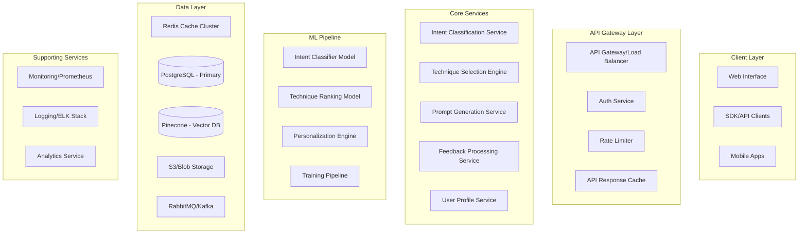

# Prompt Engineering Assistant - System Architecture

## Executive Summary

This document presents a comprehensive system architecture for an intelligent prompt engineering assistant that automatically applies advanced prompting techniques based on user intent. The architecture emphasizes scalability, maintainability, and user experience while hiding technical complexity.

## Architecture Overview

### System Architecture Diagram



## Domain-Driven Design

### Bounded Contexts

```yaml
UserManagement:
  Entities:
    - User
    - UserProfile
    - Preferences
    - Subscription
  Services:
    - AuthenticationService
    - ProfileService
    - PreferenceService
  
PromptEngineering:
  Entities:
    - Intent
    - Technique
    - Template
    - EnhancedPrompt
  Services:
    - IntentClassificationService
    - TechniqueSelectionService
    - PromptGenerationService
    
Learning:
  Entities:
    - Feedback
    - PerformanceMetric
    - UserPattern
  Services:
    - FeedbackService
    - ModelTrainingService
    - PersonalizationService
    
Analytics:
  Entities:
    - UsageMetric
    - PerformanceReport
    - BusinessMetric
  Services:
    - MetricsService
    - ReportingService
    - DashboardService
```

## Core Components Design

### 1. Intent Classification Service

```typescript
interface IntentClassificationService {
  classifyIntent(input: UserInput): Promise<IntentClassification>
  classifyMultiIntent(input: UserInput): Promise<IntentClassification[]>
  classifyWithContext(input: UserInput, context: UserContext): Promise<IntentClassification>
}

interface IntentClassification {
  primaryIntent: IntentType
  confidence: number
  subIntents: IntentType[]
  complexity: ComplexityLevel
  suggestedTechniques: TechniqueType[]
  metadata: {
    domain: string
    taskType: string
    estimatedTokens: number
    language: string
  }
}

enum IntentType {
  CREATIVE_WRITING = 'creative_writing',
  ANALYSIS = 'analysis',
  CODE_GENERATION = 'code_generation',
  RESEARCH = 'research',
  PROBLEM_SOLVING = 'problem_solving',
  LEARNING = 'learning',
  SUMMARIZATION = 'summarization',
  TRANSLATION = 'translation',
  CONVERSATION = 'conversation',
  DATA_EXTRACTION = 'data_extraction',
  REASONING = 'reasoning',
  PLANNING = 'planning'
}
```

### 2. Technique Selection Engine

```typescript
interface TechniqueSelectionEngine {
  selectTechnique(
    intent: IntentClassification,
    userProfile: UserProfile
  ): Promise<TechniqueRecommendation>
  
  getTechniqueOptions(
    intent: IntentClassification,
    count: number
  ): Promise<TechniqueRecommendation[]>
  
  updateTechniquePerformance(
    techniqueId: string,
    feedback: UserFeedback
  ): Promise<void>
}

interface TechniqueRecommendation {
  technique: PromptTechnique
  confidence: number
  reasoning: string
  expectedImprovement: number
  alternativeTechniques: PromptTechnique[]
  personalizationScore: number
}
```

### 3. Prompt Generation Service

```typescript
interface PromptGenerationService {
  generatePrompt(
    userInput: string,
    technique: PromptTechnique,
    parameters?: Record<string, any>
  ): Promise<EnhancedPrompt>
  
  generateVariations(
    userInput: string,
    techniques: PromptTechnique[],
    count: number
  ): Promise<EnhancedPrompt[]>
  
  streamGeneratePrompt(
    userInput: string,
    technique: PromptTechnique
  ): AsyncIterator<PromptChunk>
}
```

## Data Models

### Core Database Schema

```sql
-- Users and authentication
CREATE TABLE users (
    id UUID PRIMARY KEY DEFAULT gen_random_uuid(),
    email VARCHAR(255) UNIQUE NOT NULL,
    created_at TIMESTAMP WITH TIME ZONE DEFAULT NOW(),
    subscription_tier VARCHAR(50) DEFAULT 'free',
    preferences JSONB DEFAULT '{}'::jsonb
);

-- Prompt engineering techniques
CREATE TABLE techniques (
    id UUID PRIMARY KEY DEFAULT gen_random_uuid(),
    name VARCHAR(255) NOT NULL,
    category VARCHAR(100) NOT NULL,
    complexity_level INTEGER CHECK (complexity_level BETWEEN 1 AND 5),
    template TEXT NOT NULL,
    parameters JSONB DEFAULT '{}'::jsonb,
    examples JSONB DEFAULT '[]'::jsonb,
    performance_metrics JSONB DEFAULT '{}'::jsonb,
    version INTEGER DEFAULT 1,
    is_active BOOLEAN DEFAULT true,
    created_at TIMESTAMP WITH TIME ZONE DEFAULT NOW(),
    updated_at TIMESTAMP WITH TIME ZONE DEFAULT NOW()
);

-- User prompt history
CREATE TABLE user_prompts (
    id UUID PRIMARY KEY DEFAULT gen_random_uuid(),
    user_id UUID REFERENCES users(id) ON DELETE CASCADE,
    session_id UUID NOT NULL,
    original_input TEXT NOT NULL,
    intent_classification JSONB NOT NULL,
    selected_technique_id UUID REFERENCES techniques(id),
    enhanced_prompt TEXT NOT NULL,
    parameters_used JSONB,
    performance_score FLOAT,
    user_rating INTEGER CHECK (user_rating BETWEEN 1 AND 5),
    feedback_text TEXT,
    response_time_ms INTEGER,
    created_at TIMESTAMP WITH TIME ZONE DEFAULT NOW()
);

-- Technique performance tracking
CREATE TABLE technique_performance (
    technique_id UUID REFERENCES techniques(id) ON DELETE CASCADE,
    intent_type VARCHAR(100) NOT NULL,
    time_period DATE NOT NULL,
    success_rate FLOAT,
    avg_improvement FLOAT,
    usage_count INTEGER DEFAULT 0,
    avg_user_rating FLOAT,
    PRIMARY KEY (technique_id, intent_type, time_period)
);

-- Create indexes for performance
CREATE INDEX idx_user_prompts_user_id ON user_prompts(user_id);
CREATE INDEX idx_user_prompts_created_at ON user_prompts(created_at DESC);
CREATE INDEX idx_technique_performance_success ON technique_performance(success_rate DESC);
```

## API Design

### RESTful API Endpoints

```yaml
Authentication:
  POST /auth/register
  POST /auth/login
  POST /auth/refresh
  POST /auth/logout

Prompt Enhancement:
  POST /api/v1/enhance
    Request:
      input: string
      options?: {
        technique?: string
        variations?: number
        explanation?: boolean
      }
    Response:
      enhanced: EnhancedPrompt
      alternatives?: EnhancedPrompt[]
      explanation?: string
      
  POST /api/v1/analyze
    Request:
      input: string
    Response:
      intent: IntentClassification
      suggestedTechniques: Technique[]
      
  GET /api/v1/techniques
    Query: ?category=x&intent=y
    Response:
      techniques: Technique[]
      
User Profile:
  GET /api/v1/profile
  PUT /api/v1/profile
  GET /api/v1/history
  
Feedback:
  POST /api/v1/feedback
    Request:
      promptId: string
      rating: number
      feedback?: string
```

## Technology Stack

### Backend Services

```yaml
Intent Classification Service:
  Language: Python 3.11+
  Framework: FastAPI
  ML Framework: Transformers, PyTorch
  Model: Fine-tuned BERT/DistilBERT
  
Technique Selection Engine:
  Language: Go 1.21+
  Framework: Gin
  Database: PostgreSQL with pgvector
  Cache: Redis
  
Prompt Generation Service:
  Language: Python 3.11+
  Framework: FastAPI
  Template Engine: Jinja2
  LLM Integration: OpenAI/Anthropic SDK
  
API Gateway:
  Technology: Kong/Nginx
  Features: Rate limiting, auth, caching
  
Message Queue:
  Technology: RabbitMQ/Kafka
  Use: Async processing, event streaming
```

### Frontend

```yaml
Web Application:
  Framework: Next.js 14+
  Language: TypeScript
  UI Library: React 18+
  Styling: Tailwind CSS
  State Management: Zustand
  
Mobile:
  Framework: React Native
  Shared Logic: TypeScript packages
```

## Scalability Design

### Horizontal Scaling Strategy

```yaml
Load Balancing:
  - Geographic distribution with CDN
  - Sticky sessions for ML model consistency
  - Health check endpoints
  
Service Scaling:
  Intent Classifier:
    - Auto-scale based on CPU/memory
    - Model caching across instances
    - Batch inference optimization
    
  Technique Selector:
    - Horizontal scaling with sharding
    - Read replicas for database
    - Distributed cache
    
  Prompt Generator:
    - Stateless design
    - Template pre-compilation
    - Connection pooling
```

### Caching Architecture

```yaml
Multi-Level Cache:
  Browser Cache:
    - Static assets: 1 year
    - API responses: 5 minutes
    
  CDN Cache:
    - Technique library: 24 hours
    - User preferences: 1 hour
    
  Application Cache:
    - Intent classifications: 5 minutes
    - Technique rankings: 15 minutes
    - Generated prompts: 1 hour
    
  Database Cache:
    - Query result cache
    - Materialized views
    - Connection pooling
```

## Security Architecture

### Security Layers

```yaml
Authentication & Authorization:
  - JWT with refresh tokens
  - OAuth 2.0 support
  - API key management
  - Role-based access control
  
Data Protection:
  - Encryption at rest (AES-256)
  - TLS 1.3 for all communications
  - PII tokenization
  - Secure key management (AWS KMS/Vault)
  
API Security:
  - Rate limiting by tier
  - Input validation
  - Output sanitization
  - CORS configuration
  
Compliance:
  - GDPR data handling
  - SOC 2 compliance
  - Regular security audits
  - Penetration testing
```

## Monitoring & Observability

### Monitoring Stack

```yaml
Metrics:
  Tool: Prometheus + Grafana
  Key Metrics:
    - API response times
    - Model inference latency
    - Cache hit rates
    - Error rates
    - User satisfaction scores
    
Logging:
  Stack: ELK (Elasticsearch, Logstash, Kibana)
  Log Levels: Structured JSON logging
  Retention: 30 days hot, 1 year cold
  
Tracing:
  Tool: Jaeger/Zipkin
  Coverage: End-to-end request tracing
  
Alerting:
  Tool: PagerDuty/Opsgenie
  Channels: Email, Slack, SMS
  SLAs: 99.9% uptime
```

## Deployment Architecture

### Container Orchestration

```yaml
Kubernetes Configuration:
  Namespaces:
    - production
    - staging
    - development
    
  Services:
    - Deployment configs with rolling updates
    - Horizontal Pod Autoscaling
    - Service mesh (Istio) for inter-service communication
    
  Storage:
    - Persistent volumes for models
    - ConfigMaps for configuration
    - Secrets for sensitive data
```

### CI/CD Pipeline

```yaml
Pipeline Stages:
  1. Code Commit:
     - Linting
     - Unit tests
     - Security scanning
     
  2. Build:
     - Docker image creation
     - Vulnerability scanning
     - Image signing
     
  3. Test:
     - Integration tests
     - Performance tests
     - ML model validation
     
  4. Deploy:
     - Staging deployment
     - Smoke tests
     - Production deployment
     - Health checks
```

## Performance Requirements

### SLAs and SLOs

```yaml
Availability:
  SLA: 99.9% uptime
  SLO: 99.95% uptime
  
Latency:
  API Response: p95 < 200ms
  Model Inference: p95 < 500ms
  End-to-end: p95 < 1s
  
Throughput:
  Sustained: 10,000 requests/second
  Burst: 50,000 requests/second
  
Error Rate:
  Target: < 0.1%
  Acceptable: < 1%
```

## Future Considerations

### Extensibility Points

1. **Multi-model Support**: Architecture supports multiple LLM providers
2. **Plugin System**: Allow third-party technique contributions
3. **Enterprise Features**: SSO, audit logs, custom models
4. **Offline Mode**: Local model inference for sensitive data
5. **Multi-language**: i18n support for global expansion

### Technical Debt Management

1. **Regular refactoring sprints**
2. **Automated dependency updates**
3. **Performance regression testing**
4. **Architecture review quarterly**
5. **Security audit bi-annually**

This architecture provides a solid foundation for building a scalable, maintainable, and user-friendly prompt engineering assistant that can grow from MVP to enterprise scale.