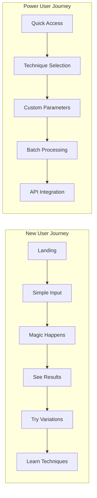

# User Interface Component Design - Prompt Engineering Assistant

## Design Philosophy

**Core Principles**:
- **Simplicity First**: Hide complexity, show power
- **Progressive Disclosure**: Reveal advanced features as users grow
- **Instant Feedback**: Real-time prompt enhancement preview
- **Educational Journey**: Learn by doing, not reading
- **Accessibility**: WCAG 2.1 AA compliant, keyboard-first design

## User Experience Architecture

### User Journey Map



## Component Architecture

### Main Interface Components

```typescript
// Core UI Components Structure
interface UIComponents {
  // Primary Input Area
  PromptInput: {
    textarea: EnhancedTextArea
    characterCount: Counter
    intentIndicator: IntentBadge
    voiceInput: VoiceRecorder
  }
  
  // Enhancement Display
  EnhancementPanel: {
    original: PromptDisplay
    enhanced: EnhancedPromptDisplay
    comparison: DiffViewer
    techniques: TechniqueCards
  }
  
  // Interaction Controls
  ActionBar: {
    enhanceButton: PrimaryAction
    variationsToggle: SecondaryAction
    historyAccess: IconButton
    settingsMenu: DropdownMenu
  }
  
  // Feedback & Learning
  FeedbackSection: {
    rating: StarRating
    improvement: TextFeedback
    technique: TechniqueExplainer
    tooltip: EducationalTooltip
  }
}
```

## Detailed Component Specifications

### 1. Landing Page Design

```jsx
const LandingPage = () => {
  return (
    <div className="min-h-screen bg-gradient-to-br from-slate-50 to-blue-50">
      {/* Hero Section */}
      <section className="container mx-auto px-4 py-16">
        <div className="max-w-4xl mx-auto text-center">
          <h1 className="text-5xl font-bold text-gray-900 mb-6">
            Write Better Prompts, Effortlessly
          </h1>
          <p className="text-xl text-gray-600 mb-8">
            Our AI understands what you want to accomplish and automatically 
            applies advanced prompting techniques. No expertise required.
          </p>
          
          {/* Main Input Component */}
          <div className="bg-white rounded-2xl shadow-xl p-8">
            <PromptInputCard />
          </div>
          
          {/* Trust Indicators */}
          <div className="mt-12 flex justify-center gap-8">
            <TrustBadge icon="shield" text="Privacy First" />
            <TrustBadge icon="bolt" text="Instant Results" />
            <TrustBadge icon="brain" text="AI Powered" />
          </div>
        </div>
      </section>
      
      {/* Examples Carousel */}
      <section className="bg-white py-16">
        <ExamplesCarousel />
      </section>
    </div>
  )
}
```

### 2. Main Input Component

```jsx
const PromptInputCard = () => {
  const [input, setInput] = useState('')
  const [intent, setIntent] = useState(null)
  const [isAnalyzing, setIsAnalyzing] = useState(false)
  
  return (
    <div className="space-y-4">
      {/* Intent Indicator */}
      {intent && (
        <div className="flex items-center gap-2">
          <span className="text-sm text-gray-500">Detected:</span>
          <IntentBadge intent={intent} />
        </div>
      )}
      
      {/* Text Input Area */}
      <div className="relative">
        <textarea
          value={input}
          onChange={(e) => handleInputChange(e.target.value)}
          placeholder="Describe what you want to accomplish..."
          className="w-full min-h-[120px] p-4 text-lg border-2 border-gray-200 
                     rounded-xl focus:border-blue-500 focus:outline-none 
                     transition-all resize-none"
          aria-label="Prompt input"
        />
        
        {/* Character Count */}
        <div className="absolute bottom-4 right-4 text-sm text-gray-400">
          {input.length} / 2000
        </div>
        
        {/* Voice Input Button */}
        <button
          className="absolute top-4 right-4 p-2 text-gray-400 
                     hover:text-gray-600 transition-colors"
          aria-label="Voice input"
        >
          <MicrophoneIcon className="w-5 h-5" />
        </button>
      </div>
      
      {/* Action Buttons */}
      <div className="flex gap-3">
        <button
          onClick={handleEnhance}
          disabled={!input || isAnalyzing}
          className="flex-1 py-3 px-6 bg-blue-600 text-white font-medium 
                     rounded-xl hover:bg-blue-700 disabled:opacity-50 
                     disabled:cursor-not-allowed transition-all
                     focus:outline-none focus:ring-4 focus:ring-blue-500/20"
        >
          {isAnalyzing ? (
            <span className="flex items-center justify-center gap-2">
              <Spinner /> Analyzing...
            </span>
          ) : (
            'Enhance My Prompt'
          )}
        </button>
        
        <button
          className="px-4 py-3 text-gray-600 hover:bg-gray-100 
                     rounded-xl transition-colors"
          aria-label="More options"
        >
          <DotsHorizontalIcon className="w-5 h-5" />
        </button>
      </div>
      
      {/* Quick Examples */}
      <div className="pt-4 border-t">
        <p className="text-sm text-gray-500 mb-2">Try an example:</p>
        <div className="flex flex-wrap gap-2">
          {QUICK_EXAMPLES.map((example) => (
            <button
              key={example.id}
              onClick={() => setInput(example.text)}
              className="px-3 py-1 text-sm bg-gray-100 text-gray-700 
                         rounded-full hover:bg-gray-200 transition-colors"
            >
              {example.label}
            </button>
          ))}
        </div>
      </div>
    </div>
  )
}
```

### 3. Enhancement Results Component

```jsx
const EnhancementResults = ({ original, enhanced, techniques }) => {
  const [view, setView] = useState('side-by-side') // 'side-by-side' | 'diff' | 'enhanced-only'
  const [showExplanation, setShowExplanation] = useState(false)
  
  return (
    <div className="bg-white rounded-2xl shadow-lg p-6 space-y-6">
      {/* View Toggle */}
      <div className="flex items-center justify-between">
        <h2 className="text-xl font-semibold">Enhanced Prompt</h2>
        <ViewToggle value={view} onChange={setView} />
      </div>
      
      {/* Technique Pills */}
      <div className="flex flex-wrap gap-2">
        {techniques.map((technique) => (
          <TechniquePill
            key={technique.id}
            technique={technique}
            onClick={() => setShowExplanation(technique.id)}
          />
        ))}
      </div>
      
      {/* Prompt Display */}
      {view === 'side-by-side' && (
        <div className="grid md:grid-cols-2 gap-4">
          <div className="space-y-2">
            <h3 className="text-sm font-medium text-gray-500">Original</h3>
            <div className="p-4 bg-gray-50 rounded-lg">
              <p className="text-gray-700">{original}</p>
            </div>
          </div>
          
          <div className="space-y-2">
            <h3 className="text-sm font-medium text-gray-500">Enhanced</h3>
            <div className="p-4 bg-blue-50 rounded-lg border-2 border-blue-200">
              <HighlightedPrompt text={enhanced} techniques={techniques} />
            </div>
          </div>
        </div>
      )}
      
      {view === 'diff' && (
        <DiffViewer original={original} enhanced={enhanced} />
      )}
      
      {view === 'enhanced-only' && (
        <div className="p-6 bg-blue-50 rounded-xl border-2 border-blue-200">
          <HighlightedPrompt text={enhanced} techniques={techniques} />
        </div>
      )}
      
      {/* Actions */}
      <div className="flex gap-3 pt-4 border-t">
        <button className="flex-1 py-2 px-4 bg-blue-600 text-white rounded-lg 
                          hover:bg-blue-700 transition-colors">
          Copy Enhanced Prompt
        </button>
        <button className="py-2 px-4 border border-gray-300 rounded-lg 
                          hover:bg-gray-50 transition-colors">
          Try Variations
        </button>
        <button className="py-2 px-4 border border-gray-300 rounded-lg 
                          hover:bg-gray-50 transition-colors">
          Save to Library
        </button>
      </div>
      
      {/* Technique Explanation Modal */}
      {showExplanation && (
        <TechniqueExplanationModal
          techniqueId={showExplanation}
          onClose={() => setShowExplanation(null)}
        />
      )}
    </div>
  )
}
```

### 4. Technique Cards Component

```jsx
const TechniqueCard = ({ technique, isRecommended, onSelect }) => {
  return (
    <div
      className={`p-4 rounded-xl border-2 cursor-pointer transition-all
                  ${isRecommended 
                    ? 'border-blue-500 bg-blue-50' 
                    : 'border-gray-200 hover:border-gray-300'}`}
      onClick={() => onSelect(technique)}
      role="button"
      tabIndex={0}
    >
      {/* Header */}
      <div className="flex items-start justify-between mb-2">
        <div>
          <h3 className="font-medium text-gray-900">{technique.name}</h3>
          {isRecommended && (
            <span className="text-xs text-blue-600 font-medium">
              Recommended for your task
            </span>
          )}
        </div>
        <div className="flex items-center gap-1">
          <ComplexityIndicator level={technique.complexity} />
        </div>
      </div>
      
      {/* Description */}
      <p className="text-sm text-gray-600 mb-3">
        {technique.shortDescription}
      </p>
      
      {/* Benefits */}
      <div className="space-y-1">
        {technique.benefits.slice(0, 2).map((benefit, idx) => (
          <div key={idx} className="flex items-center gap-2 text-xs text-gray-500">
            <CheckIcon className="w-3 h-3 text-green-500" />
            <span>{benefit}</span>
          </div>
        ))}
      </div>
      
      {/* Performance Indicator */}
      <div className="mt-3 pt-3 border-t">
        <div className="flex items-center justify-between text-xs">
          <span className="text-gray-500">Success rate</span>
          <span className="font-medium text-gray-700">
            {technique.successRate}%
          </span>
        </div>
      </div>
    </div>
  )
}
```

### 5. Educational Components

```jsx
const TechniqueExplainer = ({ technique, example }) => {
  const [isExpanded, setIsExpanded] = useState(false)
  
  return (
    <div className="bg-gradient-to-br from-purple-50 to-pink-50 rounded-xl p-6">
      <div className="flex items-start gap-4">
        <div className="p-3 bg-white rounded-lg shadow-sm">
          <LightbulbIcon className="w-6 h-6 text-purple-600" />
        </div>
        
        <div className="flex-1">
          <h3 className="font-semibold text-gray-900 mb-2">
            You just used {technique.name}!
          </h3>
          
          <p className="text-gray-700 mb-3">
            {technique.educationalDescription}
          </p>
          
          {!isExpanded && (
            <button
              onClick={() => setIsExpanded(true)}
              className="text-purple-600 font-medium text-sm hover:text-purple-700"
            >
              Learn more →
            </button>
          )}
          
          {isExpanded && (
            <div className="mt-4 space-y-4">
              {/* How it works */}
              <div>
                <h4 className="font-medium text-gray-900 mb-2">How it works:</h4>
                <p className="text-gray-600 text-sm">{technique.explanation}</p>
              </div>
              
              {/* Example comparison */}
              <div className="grid md:grid-cols-2 gap-3">
                <div className="p-3 bg-white/70 rounded-lg">
                  <p className="text-xs font-medium text-gray-500 mb-1">Without {technique.name}:</p>
                  <p className="text-sm text-gray-700">{example.without}</p>
                </div>
                <div className="p-3 bg-white rounded-lg">
                  <p className="text-xs font-medium text-gray-500 mb-1">With {technique.name}:</p>
                  <p className="text-sm text-gray-700">{example.with}</p>
                </div>
              </div>
              
              {/* Try it yourself */}
              <div className="pt-3 border-t">
                <button className="text-purple-600 font-medium text-sm hover:text-purple-700">
                  Try another example →
                </button>
              </div>
            </div>
          )}
        </div>
      </div>
    </div>
  )
}
```

### 6. History & Library Component

```jsx
const PromptLibrary = ({ userId }) => {
  const [filter, setFilter] = useState('all') // 'all' | 'favorites' | 'recent'
  const [searchQuery, setSearchQuery] = useState('')
  
  return (
    <div className="max-w-6xl mx-auto p-6">
      {/* Header */}
      <div className="flex items-center justify-between mb-8">
        <h1 className="text-2xl font-bold text-gray-900">Your Prompt Library</h1>
        <button className="px-4 py-2 bg-blue-600 text-white rounded-lg 
                          hover:bg-blue-700 transition-colors">
          New Prompt
        </button>
      </div>
      
      {/* Filters and Search */}
      <div className="flex gap-4 mb-6">
        <div className="flex-1">
          <SearchInput
            value={searchQuery}
            onChange={setSearchQuery}
            placeholder="Search your prompts..."
          />
        </div>
        
        <FilterTabs value={filter} onChange={setFilter} />
      </div>
      
      {/* Prompt Grid */}
      <div className="grid md:grid-cols-2 lg:grid-cols-3 gap-4">
        {filteredPrompts.map((prompt) => (
          <PromptCard
            key={prompt.id}
            prompt={prompt}
            onEdit={handleEdit}
            onDuplicate={handleDuplicate}
            onDelete={handleDelete}
          />
        ))}
      </div>
      
      {/* Empty State */}
      {filteredPrompts.length === 0 && (
        <EmptyState
          icon={SparklesIcon}
          title="No prompts found"
          description="Start creating enhanced prompts to build your library"
          action={{
            label: "Create your first prompt",
            onClick: handleCreateNew
          }}
        />
      )}
    </div>
  )
}
```

### 7. Settings & Preferences

```jsx
const UserSettings = () => {
  return (
    <div className="max-w-4xl mx-auto p-6">
      <h1 className="text-2xl font-bold text-gray-900 mb-8">Settings</h1>
      
      <div className="space-y-6">
        {/* Preferences */}
        <SettingsSection title="Preferences">
          <ToggleSetting
            label="Auto-enhance on paste"
            description="Automatically enhance prompts when pasting"
            value={settings.autoEnhance}
            onChange={(val) => updateSetting('autoEnhance', val)}
          />
          
          <SelectSetting
            label="Default complexity level"
            options={['Simple', 'Moderate', 'Advanced']}
            value={settings.defaultComplexity}
            onChange={(val) => updateSetting('defaultComplexity', val)}
          />
          
          <ToggleSetting
            label="Show technique explanations"
            description="Display educational tooltips for techniques"
            value={settings.showExplanations}
            onChange={(val) => updateSetting('showExplanations', val)}
          />
        </SettingsSection>
        
        {/* Accessibility */}
        <SettingsSection title="Accessibility">
          <ToggleSetting
            label="High contrast mode"
            value={settings.highContrast}
            onChange={(val) => updateSetting('highContrast', val)}
          />
          
          <SelectSetting
            label="Font size"
            options={['Small', 'Medium', 'Large', 'Extra Large']}
            value={settings.fontSize}
            onChange={(val) => updateSetting('fontSize', val)}
          />
          
          <ToggleSetting
            label="Reduce motion"
            description="Minimize animations and transitions"
            value={settings.reduceMotion}
            onChange={(val) => updateSetting('reduceMotion', val)}
          />
        </SettingsSection>
        
        {/* API Access */}
        <SettingsSection title="API Access">
          <ApiKeyManager />
        </SettingsSection>
      </div>
    </div>
  )
}
```

## Responsive Design

### Mobile-First Approach

```jsx
const MobilePromptInterface = () => {
  return (
    <div className="min-h-screen bg-gray-50 pb-20">
      {/* Sticky Header */}
      <header className="sticky top-0 z-10 bg-white border-b px-4 py-3">
        <div className="flex items-center justify-between">
          <h1 className="text-lg font-semibold">Prompt Assistant</h1>
          <button className="p-2">
            <MenuIcon className="w-5 h-5" />
          </button>
        </div>
      </header>
      
      {/* Main Content */}
      <main className="px-4 py-4">
        {/* Input Card */}
        <div className="bg-white rounded-xl shadow-sm p-4 mb-4">
          <textarea
            className="w-full min-h-[100px] text-base resize-none 
                      focus:outline-none"
            placeholder="What do you want to create?"
          />
          
          <div className="flex items-center justify-between mt-3">
            <span className="text-xs text-gray-500">0 / 500</span>
            <button className="px-4 py-2 bg-blue-600 text-white text-sm 
                              font-medium rounded-lg">
              Enhance
            </button>
          </div>
        </div>
        
        {/* Quick Actions */}
        <div className="grid grid-cols-2 gap-3">
          <QuickActionCard icon={SparklesIcon} label="Examples" />
          <QuickActionCard icon={ClockIcon} label="History" />
        </div>
      </main>
      
      {/* Bottom Navigation */}
      <nav className="fixed bottom-0 left-0 right-0 bg-white border-t">
        <div className="grid grid-cols-4 py-2">
          <NavItem icon={HomeIcon} label="Home" active />
          <NavItem icon={BookmarkIcon} label="Saved" />
          <NavItem icon={ChartBarIcon} label="Stats" />
          <NavItem icon={UserIcon} label="Profile" />
        </div>
      </nav>
    </div>
  )
}
```

## Accessibility Features

### WCAG 2.1 AA Compliance

```jsx
const AccessibilityFeatures = {
  // Keyboard Navigation
  keyboardShortcuts: {
    'Ctrl+Enter': 'Enhance prompt',
    'Ctrl+/': 'Focus search',
    'Ctrl+S': 'Save prompt',
    'Esc': 'Close modal',
    'Tab': 'Navigate forward',
    'Shift+Tab': 'Navigate backward'
  },
  
  // Screen Reader Support
  ariaLabels: {
    enhanceButton: 'Enhance your prompt with AI',
    techniqueCard: 'Select {technique} technique',
    copyButton: 'Copy enhanced prompt to clipboard',
    ratingStars: 'Rate this enhancement {stars} out of 5 stars'
  },
  
  // Visual Accessibility
  colorContrast: {
    normalText: '7:1',
    largeText: '4.5:1',
    interactive: '3:1'
  },
  
  // Focus Management
  focusIndicators: {
    style: '2px solid #2563eb',
    offset: '2px',
    borderRadius: 'inherit'
  }
}
```

## Animation & Interaction Design

### Micro-interactions

```css
/* Smooth transitions for better UX */
.prompt-card {
  transition: all 0.2s ease-out;
}

.prompt-card:hover {
  transform: translateY(-2px);
  box-shadow: 0 4px 12px rgba(0, 0, 0, 0.1);
}

/* Loading states */
@keyframes shimmer {
  0% {
    background-position: -1000px 0;
  }
  100% {
    background-position: 1000px 0;
  }
}

.skeleton {
  background: linear-gradient(
    90deg,
    #f0f0f0 25%,
    #e0e0e0 50%,
    #f0f0f0 75%
  );
  background-size: 1000px 100%;
  animation: shimmer 2s infinite;
}

/* Reduced motion support */
@media (prefers-reduced-motion: reduce) {
  * {
    animation-duration: 0.01ms !important;
    animation-iteration-count: 1 !important;
    transition-duration: 0.01ms !important;
  }
}
```

## Performance Optimization

### Component Performance

```typescript
// Optimized component rendering
const EnhancedPromptDisplay = React.memo(({ prompt, techniques }) => {
  // Memoize expensive calculations
  const highlightedSegments = useMemo(
    () => calculateHighlights(prompt, techniques),
    [prompt, techniques]
  );
  
  // Virtualize long lists
  const virtualizer = useVirtual({
    size: techniques.length,
    parentRef,
    estimateSize: useCallback(() => 80, []),
    overscan: 5
  });
  
  return (
    <div ref={parentRef} className="h-full overflow-auto">
      {virtualizer.virtualItems.map((virtualItem) => (
        <div
          key={virtualItem.index}
          style={{
            position: 'absolute',
            top: 0,
            left: 0,
            width: '100%',
            transform: `translateY(${virtualItem.start}px)`
          }}
        >
          <TechniqueCard technique={techniques[virtualItem.index]} />
        </div>
      ))}
    </div>
  );
});

// Lazy load heavy components
const TechniqueLibrary = lazy(() => import('./TechniqueLibrary'));
const AnalyticsPanel = lazy(() => import('./AnalyticsPanel'));
```

## Theme System

### Design Tokens

```typescript
const theme = {
  colors: {
    primary: {
      50: '#eff6ff',
      100: '#dbeafe',
      200: '#bfdbfe',
      300: '#93c5fd',
      400: '#60a5fa',
      500: '#3b82f6',
      600: '#2563eb',
      700: '#1d4ed8',
      800: '#1e40af',
      900: '#1e3a8a'
    },
    gray: {
      50: '#f9fafb',
      100: '#f3f4f6',
      200: '#e5e7eb',
      300: '#d1d5db',
      400: '#9ca3af',
      500: '#6b7280',
      600: '#4b5563',
      700: '#374151',
      800: '#1f2937',
      900: '#111827'
    },
    semantic: {
      success: '#10b981',
      warning: '#f59e0b',
      error: '#ef4444',
      info: '#3b82f6'
    }
  },
  
  typography: {
    fontFamily: {
      sans: ['Inter', 'system-ui', 'sans-serif'],
      mono: ['JetBrains Mono', 'monospace']
    },
    fontSize: {
      xs: '0.75rem',
      sm: '0.875rem',
      base: '1rem',
      lg: '1.125rem',
      xl: '1.25rem',
      '2xl': '1.5rem',
      '3xl': '1.875rem',
      '4xl': '2.25rem',
      '5xl': '3rem'
    }
  },
  
  spacing: {
    0: '0',
    1: '0.25rem',
    2: '0.5rem',
    3: '0.75rem',
    4: '1rem',
    5: '1.25rem',
    6: '1.5rem',
    8: '2rem',
    10: '2.5rem',
    12: '3rem',
    16: '4rem',
    20: '5rem',
    24: '6rem'
  },
  
  borderRadius: {
    none: '0',
    sm: '0.125rem',
    base: '0.25rem',
    md: '0.375rem',
    lg: '0.5rem',
    xl: '0.75rem',
    '2xl': '1rem',
    '3xl': '1.5rem',
    full: '9999px'
  }
}
```

## Component Library Structure

```typescript
// Component organization
export const UIComponents = {
  // Core Components
  Button,
  Input,
  TextArea,
  Select,
  Toggle,
  Card,
  Modal,
  Tooltip,
  
  // Domain Components
  PromptInput,
  EnhancementDisplay,
  TechniqueCard,
  IntentBadge,
  ComplexityIndicator,
  
  // Layout Components
  Container,
  Grid,
  Stack,
  Divider,
  
  // Feedback Components
  Alert,
  Toast,
  Progress,
  Spinner,
  
  // Navigation Components
  Tabs,
  Breadcrumb,
  Pagination,
  
  // Data Display
  Table,
  List,
  EmptyState,
  
  // Icons
  Icons
}
```

## Testing Strategy

### Component Testing

```typescript
describe('PromptInputCard', () => {
  it('should detect intent as user types', async () => {
    const { getByPlaceholderText, getByText } = render(<PromptInputCard />);
    const input = getByPlaceholderText('Describe what you want to accomplish...');
    
    await userEvent.type(input, 'Write a story about a dragon');
    
    await waitFor(() => {
      expect(getByText('Creative Writing')).toBeInTheDocument();
    });
  });
  
  it('should be accessible with keyboard navigation', async () => {
    const { getByRole } = render(<PromptInputCard />);
    const enhanceButton = getByRole('button', { name: /enhance/i });
    
    await userEvent.tab();
    expect(document.activeElement).toBe(enhanceButton);
  });
  
  it('should show loading state during enhancement', async () => {
    const { getByRole, getByText } = render(<PromptInputCard />);
    const button = getByRole('button', { name: /enhance/i });
    
    await userEvent.click(button);
    expect(getByText('Analyzing...')).toBeInTheDocument();
  });
});
```

## Deployment Considerations

### Progressive Web App

```json
{
  "name": "Prompt Engineering Assistant",
  "short_name": "PromptAssist",
  "description": "AI-powered prompt enhancement tool",
  "start_url": "/",
  "display": "standalone",
  "orientation": "portrait",
  "theme_color": "#2563eb",
  "background_color": "#ffffff",
  "icons": [
    {
      "src": "/icon-192.png",
      "sizes": "192x192",
      "type": "image/png"
    },
    {
      "src": "/icon-512.png",
      "sizes": "512x512",
      "type": "image/png"
    }
  ]
}
```

## Conclusion

This UI design creates an intuitive, accessible, and powerful interface that makes advanced prompt engineering techniques available to everyone. The progressive disclosure approach ensures new users aren't overwhelmed while power users have access to advanced features. The focus on education through interaction helps users learn techniques naturally as they use the system.