# BetterPrompts Application Architecture Visualization

This document provides visual representations of the BetterPrompts application based on actual testing and verification of the running system.

## System Overview

BetterPrompts is a prompt engineering assistant that automatically enhances user prompts by analyzing intent, selecting appropriate techniques, and generating improved prompts.

## 1. High-Level System Architecture

```mermaid
graph TB
    subgraph "Client Layer"
        Client[User/Client]
    end
    
    subgraph "Gateway Layer"
        Nginx[Nginx Reverse Proxy<br/>:80]
    end
    
    subgraph "API Layer"
        Gateway[API Gateway<br/>Go/Gin<br/>:8000→8090]
    end
    
    subgraph "Core Services"
        Intent[Intent Classifier<br/>Python/FastAPI<br/>:8001]
        Selector[Technique Selector<br/>Go/Gin<br/>:8002]
        Generator[Prompt Generator<br/>Python/FastAPI<br/>:8003]
    end
    
    subgraph "ML Infrastructure"
        TorchServe[TorchServe<br/>Model Serving<br/>:8080-8082]
    end
    
    subgraph "Data Layer"
        Postgres[(PostgreSQL<br/>w/ pgvector<br/>:5432)]
        Redis[(Redis Cache<br/>:6379)]
    end
    
    subgraph "Monitoring"
        Prometheus[Prometheus<br/>:9090]
        Grafana[Grafana<br/>:3001]
    end
    
    Client --> Nginx
    Nginx --> Gateway
    Gateway --> Intent
    Gateway --> Selector
    Gateway --> Generator
    Intent -.-> TorchServe
    Intent --> Postgres
    Selector --> Postgres
    Generator --> Postgres
    Intent --> Redis
    Selector --> Redis
    Generator --> Redis
    Gateway --> Redis
    
    Prometheus --> Gateway
    Prometheus --> Intent
    Prometheus --> Selector
    Prometheus --> Generator
    Grafana --> Prometheus
```



### Architecture Explanation

**Client Layer**: Users interact with the system through HTTP requests to the API.

**Gateway Layer**: Nginx serves as a reverse proxy, handling rate limiting, SSL termination, and routing requests to the API Gateway.

**API Layer**: The Go-based API Gateway orchestrates requests between microservices and provides authentication, CORS, and centralized logging.

**Core Services**: Three specialized microservices handle the prompt enhancement pipeline:
- Intent Classifier analyzes user input to determine intent and complexity
- Technique Selector chooses optimal prompt engineering techniques
- Prompt Generator applies techniques to create enhanced prompts

**ML Infrastructure**: TorchServe provides production-ready model serving for the intent classification model.

**Data Layer**: PostgreSQL stores persistent data with vector support, while Redis provides caching and session management.

## 2. Request Flow Diagram


### Request Flow Explanation

1. **Client Request**: User sends original text to be enhanced
2. **Gateway Routing**: Nginx forwards to API Gateway with rate limiting
3. **Intent Analysis**: Text is analyzed to determine user's intent and complexity level
4. **Technique Selection**: Based on intent, appropriate prompt engineering techniques are selected
5. **Prompt Generation**: Selected techniques are applied to generate an enhanced prompt
6. **Response Assembly**: Gateway combines all results with metadata and returns to client

## 3. Service Endpoints Map

```mermaid
graph LR
    subgraph "Nginx :80"
        N1["/health → 200 OK"]
        N2["/api/v1/* → API Gateway"]
    end
    
    subgraph "API Gateway :8000"
        G1["/api/v1/health → Service Status"]
        G2["/api/v1/enhance → Main Pipeline"]
        G3["/api/v1/analyze → Intent Only"]
        G4["/api/v1/techniques → List Techniques"]
    end
    
    subgraph "Intent Classifier :8001"
        I1["/health → Service Health"]
        I2["/api/v1/intents/classify → Classify Text"]
        I3["/api/v1/intents/types → Available Types"]
        I4["/docs → Swagger UI"]
    end
    
    subgraph "Technique Selector :8002"
        S1["/health → Service Health"]
        S2["/api/v1/select → Select Techniques"]
        S3["/api/v1/techniques → List All"]
    end
    
    subgraph "Prompt Generator :8003"
        P1["/health → Service Health"]
        P2["/api/v1/generate → Generate Prompt"]
        P3["/api/v1/techniques → Supported Techniques"]
        P4["/docs → Swagger UI"]
    end
    
    subgraph "TorchServe :8080-8082"
        T1[":8080/ping → Health Check"]
        T2[":8080/predictions/intent_classifier → ML Inference"]
        T3[":8081/models → Model Management"]
        T4[":8082/metrics → Model Metrics"]
    end
```



### Endpoint Explanation

**Verified Working Endpoints** (from our testing):
- All health endpoints return proper status
- Main enhancement pipeline processes requests end-to-end
- Individual services expose specific functionality
- TorchServe provides model serving capabilities (worker issues in development)

## 4. Data Flow Architecture

```mermaid
flowchart TD
    Input[User Input Text] --> Classify{Intent Classification}
    
    Classify -->|"question_answering<br/>confidence: 0.31"| QA[Question Answering Path]
    Classify -->|"code_generation<br/>confidence: 0.37"| Code[Code Generation Path]
    Classify -->|"creative_writing<br/>confidence: 0.28"| Creative[Creative Writing Path]
    
    QA --> QATech[["zero_shot"]]
    Code --> CodeTech[["step_by_step"]]
    Creative --> CreativeTech[["role_play + emotional_appeal"]]
    
    QATech --> GenQA[Generate Enhanced Prompt]
    CodeTech --> GenCode[Generate Enhanced Prompt]
    CreativeTech --> GenCreative[Generate Enhanced Prompt]
    
    GenQA --> Output[Enhanced Prompt + Metadata]
    GenCode --> Output
    GenCreative --> Output
    
    Output --> Response{{"id": "", "original_text": "...", "enhanced_prompt": "...", "techniques_used": [...], "confidence": 0.x}}
```

### Data Flow Explanation

**Classification Stage**: Input text is analyzed to determine:
- Intent type (question_answering, code_generation, creative_writing, etc.)
- Complexity level (simple, moderate, complex)
- Confidence score for the classification

**Technique Selection**: Based on intent and complexity:
- Different techniques are selected for different intent types
- Multiple techniques can be combined for better results
- Confidence scores influence technique selection

**Generation Stage**: Selected techniques are applied:
- Techniques transform the original prompt
- Multiple techniques are chained together
- Metadata tracks the enhancement process

## 5. Docker Compose Architecture


### Container Architecture Explanation

**Network Isolation**: All services run in the `betterprompts-network` Docker network, enabling secure inter-service communication.

**Port Mapping**: Each service exposes specific ports:
- External access through Nginx on port 80
- Individual services accessible for debugging on their respective ports
- Database services accessible for development on standard ports

**Volume Management**: Persistent data is stored in named volumes:
- Database data persists across container restarts
- Model files and cache data are preserved
- Monitoring data is maintained

**Health Checks**: All services include health check configurations to ensure proper startup order and monitoring.

## 6. Technology Stack Summary


## Current System Status

Based on our testing session:

### ✅ Fully Operational
- All 10 services start successfully
- Health endpoints respond correctly
- Main enhancement pipeline works end-to-end
- Individual service APIs function properly
- Inter-service communication established
- Database connections stable
- Cache layer operational

### ⚠️ Known Issues
- TorchServe model worker experiences crashes (development environment limitation)
- Some endpoint paths may need documentation updates
- Frontend service not included in current Docker setup

### 🔧 Access Points
- **Main API**: `http://localhost/api/v1/`
- **Service Documentation**: `http://localhost:8001/docs`, `http://localhost:8003/docs`
- **Monitoring**: `http://localhost:3001` (Grafana), `http://localhost:9090` (Prometheus)
- **Individual Services**: Ports 8001-8003 for direct access

This architecture successfully demonstrates a working microservices-based prompt enhancement system with proper separation of concerns, monitoring, and scalability considerations.